# مخططات مشروع نظام توزيع الكتب المدرسية - Ketabi
## Graduation Project Diagrams

---

## 📋 جدول المحتويات

### الأقسام الرئيسية
1. [📊 العمليات الحالية](#current-operations) - ملخص الميزات المُنجزة
2. [🗄️ ERD - Entity Relationship Diagram](#erd) - نموذج العلاقات بين الكائنات
3. [🏗️ Class Diagram](#class-diagram) - هيكل الفئات والعلاقات
4. [👥 Use Case Diagram](#use-cases) - حالات الاستخدام
5. [🔄 Sequence Diagrams](#sequence-diagrams) - سيناريوهات العمليات
6. [📊 Activity Diagrams](#activity-diagrams) - تدفقات العمليات
7. [📝 ملاحظات تحديث الملف](#update-notes) - معلومات التحديث والـ APIs

### أقسام العمليات الحالية (Current Operations)
- [نظام طلبات المدارس](#school-requests)
- [نظام الشحنات](#shipments)
- [نظام إنشاء الشحنات من الطلبات](#shipment-creation)
- [نظام المندوبين](#couriers)
- [نظام المخزون](#warehouse-stock)
- [نظام الإشعارات](#notifications)

### أقسام Sequence Diagrams
- [1. إنشاء طلب مدرسة واعتماده](#seq-1)
- [2. إنشاء شحنة من طلب المدرسة المعتمد](#seq-2)
- [3. توصيل الشحنة من قبل المندوب](#seq-3)
- [4. طلب المحافظة من الوزارة](#seq-4)
- [5. نظام الإشعارات والـ Push Notifications](#seq-5)

### أقسام Activity Diagrams
- [1. سير عمل طلب المدرسة](#activity-1)
- [2. سير عمل طلب المحافظة من الوزارة](#activity-2)
- [3. سير عمل المندوب (Courier Workflow)](#activity-3)
- [4. سير عمل نظام الإشعارات](#activity-4)
- [5. إدارة المخزون والتنبيهات](#activity-5)

---

## � العمليات الحالية {#current-operations}

### ✅ الميزات المُنجزة والمستخدمة

#### 1️⃣ نظام طلبات المدارس (School Requests) {#school-requests}
- **الحالات المدعومة:** draft, submitted, approved, rejected, fulfilled, cancelled
- **العمليات:**
  - إنشاء طلب من قبل موظف المدرسة
  - مراجعة واعتماد من قبل موظف المحافظة
  - التحقق من المخزون قبل الموافقة
  - إنشاء شحنات مباشرة من الطلب المعتمد

#### 2️⃣ نظام الشحنات (Shipments) {#shipments}
- **نوعا الشحنات:**
  - `MinistryToProvinceShipment` - من الوزارة للمحافظة
  - `ProvinceToSchoolShipment` - من المحافظة للمدرسة
  
- **حقول الشحنة:**
  - `tracking_code` - كود التتبع الفريد
  - `qr_token` - رمز QR للتحقق
  - `qr_code_image` - صورة QR Code
  - `status` - حالة الشحنة (pending, assigned, out_for_delivery, delivered)
  - `related_school_request` - ربط بطلب المدرسة الأصلي
  - `delivered_at` - تاريخ التسليم الفعلي
  - `delivery_notes` - ملاحظات التسليم

#### 3️⃣ نظام إنشاء الشحنات من الطلبات {#shipment-creation}
- **الوظيفة:** إنشاء شحنات مباشرة من طلبات المدارس المعتمدة
- **الخطوات:**
  1. جلب الطلبات المعتمدة: `GET /warehouses/province/school-requests/approved/`
  2. اختيار المندوب والطلب
  3. إنشاء الشحنة: `POST /warehouses/province/shipments/create-from-request/`
  4. خصم المخزون تلقائياً
  5. إنشاء QR Code ورمز التتبع

#### 4️⃣ نظام المندوبين (Couriers/Drivers) {#couriers}
- **الأدوار:**
  - `province_driver` - مندوب المحافظة
  - `ministry_driver` - مندوب الوزارة
  
- **العمليات:**
  - عرض الشحنات المسندة
  - بدء التوصيل
  - مسح QR Code عند الوصول
  - تأكيد التسليم مع التوقيع
  - رفع الصور والملاحظات

#### 5️⃣ نظام المخزون (Warehouse Stock) {#warehouse-stock}
- **حقول المخزون:**
  - `ministry_warehouse_id` - للمخزن المركزي
  - `province_warehouse_id` - لمخزن المحافظة
  - `book_id` - الكتاب
  - `term` - الفصل الدراسي
  - `quantity` - الكمية المتوفرة
  - `min_threshold` - الحد الأدنى للكمية

#### 6️⃣ نظام الإشعارات {#notifications}
- **أنواع الإشعارات:**
  - `school_request_created` - طلب مدرسة جديد
  - `school_request_approved` - موافقة على طلب
  - `school_request_rejected` - رفض طلب
  - `shipment_created` - شحنة جديدة
  - `shipment_assigned` - تعيين مندوب
  - `shipment_out_for_delivery` - شحنة قيد التوصيل
  - `shipment_delivered` - شحنة تم تسليمها
  - `low_stock_alert` - تنبيه مخزون منخفض

- **الآلية:** Firebase Cloud Messaging (FCM) + WebSocket للتحديثات المباشرة

---

## 🗄️ ERD - Entity Relationship Diagram {#erd}

```mermaid
    User ||--o{ Notification : "receives"
    User ||--o{ DeviceToken : "owns"
    User ||--o{ BookRequest : "creates"
    User ||--o{ SchoolRequest : "creates"
    User ||--o{ MinistryToProvinceShipment : "delivers"
    User ||--o{ ProvinceToSchoolShipment : "delivers"
    User }o--|| School : "works_at"
    
    Province ||--o{ Directorate : "contains"
    Province ||--o{ School : "has"
    Province ||--o{ ProvinceWarehouse : "has"
    
    Directorate ||--o{ School : "has"
    
    School ||--o{ SchoolRequest : "submits"
    School }o--|| Province : "belongs_to"
    School }o--o| Directorate : "belongs_to"
    
    Book ||--o{ SchoolRequestItem : "ordered_in"
    Book ||--o{ BookRequestItem : "requested_in"
    Book ||--o{ WarehouseStock : "stored_in"
    
    SchoolRequest ||--|{ SchoolRequestItem : "contains"
    SchoolRequest }o--|| User : "reviewed_by"
    SchoolRequest }o--|| User : "created_by"
    
    BookRequest ||--|{ BookRequestItem : "contains"
    BookRequest ||--o{ MinistryToProvinceShipment : "generates"
    BookRequest }o--|| User : "reviewed_by"
    BookRequest }o--|| User : "created_by"
    
    SchoolRequest ||--o{ ProvinceToSchoolShipment : "generates"
    
    MinistryToProvinceShipment }o--|| MinistryWarehouse : "from"
    MinistryToProvinceShipment }o--|| ProvinceWarehouse : "to"
    MinistryToProvinceShipment }o--|| User : "assigned_courier"
    MinistryToProvinceShipment }o--o| BookRequest : "fulfills"
    
    ProvinceToSchoolShipment }o--|| ProvinceWarehouse : "from"
    ProvinceToSchoolShipment }o--|| School : "to"
    ProvinceToSchoolShipment }o--|| User : "assigned_courier"
    ProvinceToSchoolShipment }o--o| SchoolRequest : "fulfills"
    
    MinistryWarehouse ||--o{ WarehouseStock : "stores"
    ProvinceWarehouse ||--o{ WarehouseStock : "stores"
    
    MinistryWarehouse }o--o{ User : "managed_by"
    ProvinceWarehouse }o--o{ User : "managed_by"

    User {
        int id PK
        string username UK
        string email
        string full_name
        string role
        string province
        int school_id FK
        boolean is_active
        boolean is_staff
    }
    
    Province {
        int id PK
        string name UK
    }
    
    Directorate {
        int id PK
        string name
        int province_id FK
        string code UK
        datetime created_at
    }
    
    School {
        int id PK
        string name
        int province_id FK
        int directorate_id FK
        string type
        string address
        string contact_phone
        int admin_id FK
        datetime created_at
    }
    
    Book {
        int id PK
        string title
        string subject
        string grade_level
        string term
        string isbn UK
        int page_count
        string publisher
    }
    
    SchoolRequest {
        int id PK
        int school_id FK
        string status
        int created_by_id FK
        int reviewed_by_id FK
        int assigned_driver_id FK
        text reason_rejected
        datetime created_at
        datetime updated_at
    }
    
    SchoolRequestItem {
        int id PK
        int request_id FK
        int book_id FK
        int quantity
        string term
    }
    
    BookRequest {
        int id PK
        string request_number UK
        string status
        text notes
        text rejection_reason
        int created_by_id FK
        int reviewed_by_id FK
        datetime created_at
        datetime reviewed_at
    }
    
    BookRequestItem {
        int id PK
        int request_id FK
        int book_id FK
        int quantity
        string term
    }
    
    MinistryToProvinceShipment {
        int id PK
        string tracking_code UK
        int from_ministry_id FK
        int to_province_id FK
        json books
        int assigned_courier_id FK
        string status
        string qr_token UK
        text qr_code_image
        datetime qr_expires_at
        boolean qr_used
        datetime delivered_at
        text delivery_notes
        int related_request_id FK
        datetime created_at
    }
    
    ProvinceToSchoolShipment {
        int id PK
        string tracking_code UK
        int from_province_id FK
        int to_school_id FK
        json books
        int assigned_courier_id FK
        string status
        string qr_token UK
        text qr_code_image
        datetime qr_expires_at
        boolean qr_used
        datetime delivered_at
        text delivery_notes
        int related_school_request_id FK
        datetime created_at
    }
    
    MinistryWarehouse {
        int id PK
        string name
        string location
    }
    
    ProvinceWarehouse {
        int id PK
        string name
        string province
    }
    
    WarehouseStock {
        int id PK
        int ministry_warehouse_id FK
        int province_warehouse_id FK
        int book_id FK
        string term
        int quantity
        int min_threshold
        datetime updated_at
    }
    
    Notification {
        int id PK
        int user_id FK
        string notification_type
        string title
        text message
        boolean read
        json metadata
        string related_object_type
        int related_object_id
        datetime created_at
    }
    
    DeviceToken {
        int id PK
        int user_id FK
        string device_token UK
        string device_type
        string device_name
        boolean is_active
        datetime created_at
    }
```

---

## 🏗️ Class Diagram {#class-diagram}

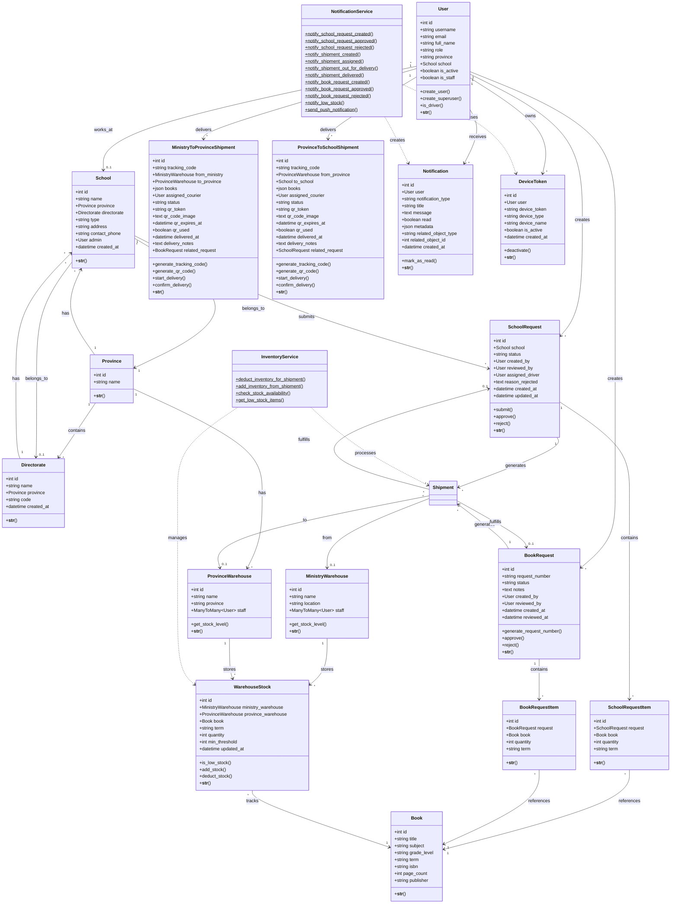

---

## 👥 Use Case Diagram {#use-cases}

```mermaid
graph TB
    subgraph "نظام توزيع الكتب المدرسية"
        subgraph "إدارة المستخدمين"
            UC1[تسجيل الدخول]
            UC2[إدارة الصلاحيات]
            UC3[تحديث الملف الشخصي]
        end
        
        subgraph "إدارة المدارس"
            UC4[إنشاء طلب كتب للمدرسة]
            UC5[تتبع حالة الطلب]
            UC6[استلام الشحنة]
            UC7[عرض المخزون المدرسي]
        end
        
        subgraph "إدارة المحافظة"
            UC8[مراجعة طلبات المدارس]
            UC9[اعتماد/رفض الطلبات]
            UC10[إنشاء طلب للوزارة]
            UC11[إدارة مخزون المحافظة]
            UC12[تعيين المندوبين]
            UC13[تتبع الشحنات]
            UC14[تقارير المحافظة]
        end
        
        subgraph "إدارة الوزارة"
            UC15[مراجعة طلبات المحافظات]
            UC16[اعتماد/رفض الطلبات]
            UC17[إنشاء شحنة للمحافظة]
            UC18[إدارة المخزون المركزي]
            UC19[تعيين مندوبي الوزارة]
            UC20[تقارير شاملة]
        end
        
        subgraph "المناديب"
            UC21[عرض الشحنات المسندة]
            UC22[بدء التوصيل]
            UC23[مسح QR Code]
            UC24[تأكيد التسليم]
            UC25[تحديث الموقع]
        end
        
        subgraph "الإشعارات"
            UC26[استقبال الإشعارات]
            UC27[قراءة الإشعارات]
            UC28[تسجيل Device Token]
        end
        
        subgraph "إدارة الكتب"
            UC29[إضافة كتاب جديد]
            UC30[تحديث معلومات الكتاب]
            UC31[البحث عن الكتب]
        end
        
        subgraph "التقارير والإحصائيات"
            UC32[تقرير Excel للمحافظة]
            UC33[Dashboard المحافظة]
            UC34[إحصائيات الشحنات]
            UC35[تقرير المخزون]
        end
    end
    
    SchoolAdmin[موظف المدرسة]
    ProvinceStaff[موظف المحافظة]
    MinistryStaff[موظف الوزارة]
    ProvinceCourier[مندوب المحافظة]
    MinistryCourier[مندوب الوزارة]
    Admin[المدير]
    
    SchoolAdmin --> UC1
    SchoolAdmin --> UC3
    SchoolAdmin --> UC4
    SchoolAdmin --> UC5
    SchoolAdmin --> UC6
    SchoolAdmin --> UC7
    SchoolAdmin --> UC26
    SchoolAdmin --> UC27
    
    ProvinceStaff --> UC1
    ProvinceStaff --> UC3
    ProvinceStaff --> UC8
    ProvinceStaff --> UC9
    ProvinceStaff --> UC10
    ProvinceStaff --> UC11
    ProvinceStaff --> UC12
    ProvinceStaff --> UC13
    ProvinceStaff --> UC14
    ProvinceStaff --> UC26
    ProvinceStaff --> UC27
    ProvinceStaff --> UC31
    
    MinistryStaff --> UC1
    MinistryStaff --> UC3
    MinistryStaff --> UC15
    MinistryStaff --> UC16
    MinistryStaff --> UC17
    MinistryStaff --> UC18
    MinistryStaff --> UC19
    MinistryStaff --> UC20
    MinistryStaff --> UC26
    MinistryStaff --> UC27
    MinistryStaff --> UC29
    MinistryStaff --> UC30
    MinistryStaff --> UC31
    
    ProvinceCourier --> UC1
    ProvinceCourier --> UC21
    ProvinceCourier --> UC22
    ProvinceCourier --> UC23
    ProvinceCourier --> UC24
    ProvinceCourier --> UC25
    ProvinceCourier --> UC26
    ProvinceCourier --> UC27
    ProvinceCourier --> UC28
    
    MinistryCourier --> UC1
    MinistryCourier --> UC21
    MinistryCourier --> UC22
    MinistryCourier --> UC23
    MinistryCourier --> UC24
    MinistryCourier --> UC25
    MinistryCourier --> UC26
    MinistryCourier --> UC27
    MinistryCourier --> UC28
    
    Admin --> UC1
    Admin --> UC2
    Admin --> UC3
    Admin --> UC20
    Admin --> UC29
    Admin --> UC30
    
    style SchoolAdmin fill:#e1f5ff
    style ProvinceStaff fill:#fff4e1
    style MinistryStaff fill:#f0e1ff
    style ProvinceCourier fill:#e1ffe1
    style MinistryCourier fill:#ffe1f5
    style Admin fill:#ffe1e1
```

---

## 🔄 Sequence Diagrams {#sequence-diagrams}

### 1. إنشاء طلب مدرسة واعتماده {#seq-1}

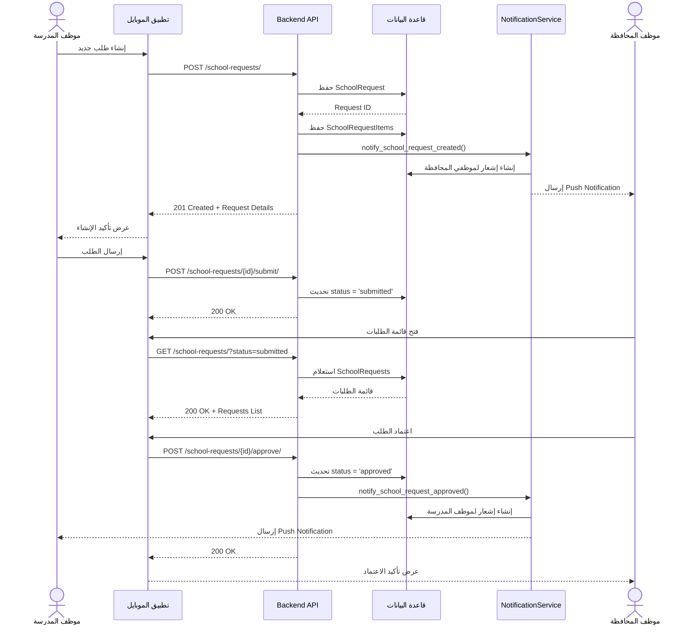

### 2️⃣ إنشاء شحنة من طلب المدرسة المعتمد (الواقع الحالي) {#seq-2}

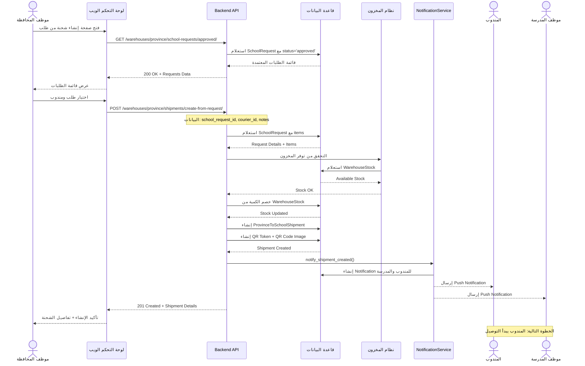

### 3️⃣ توصيل الشحنة من قبل المندوب {#seq-3}

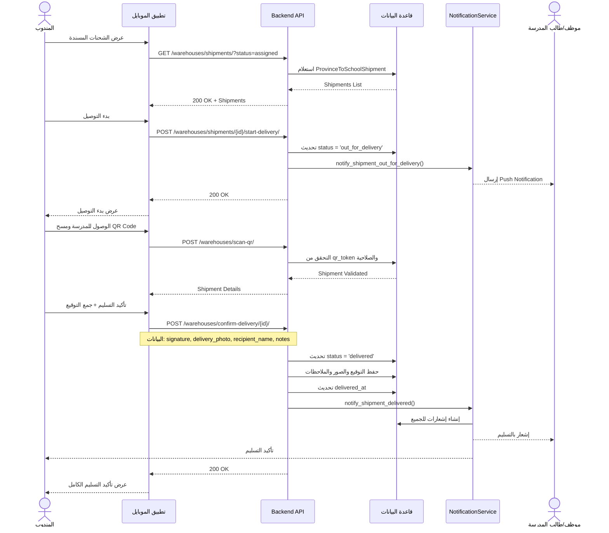

### 4️⃣ طلب المحافظة من الوزارة (Book Request) {#seq-4}

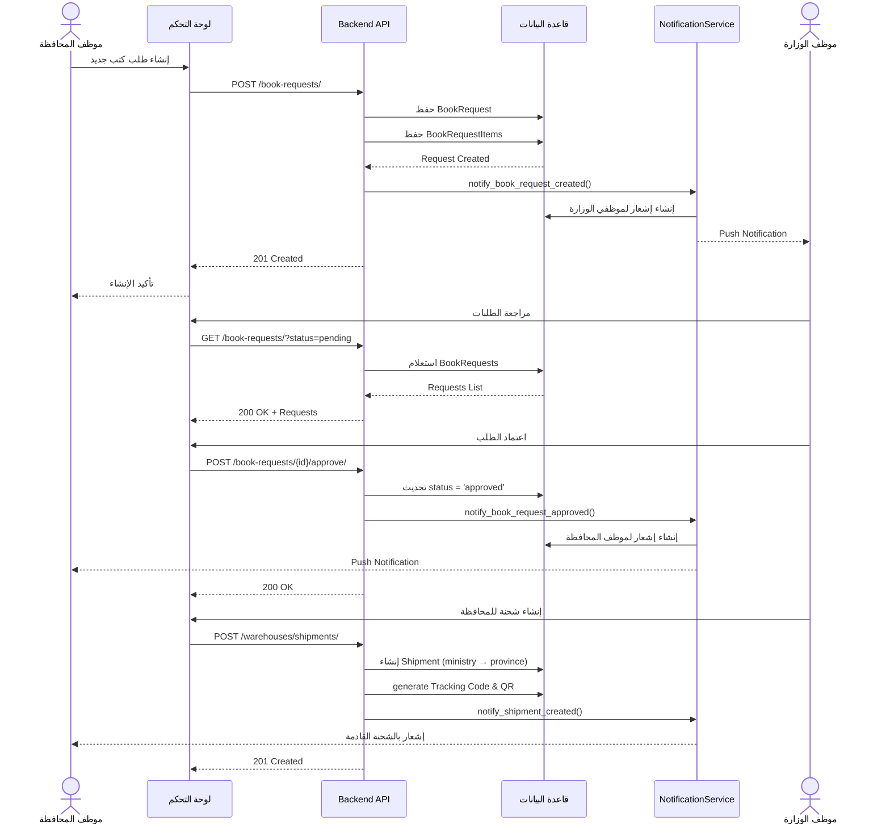

### 5️⃣ نظام الإشعارات والـ Push Notifications {#seq-5}

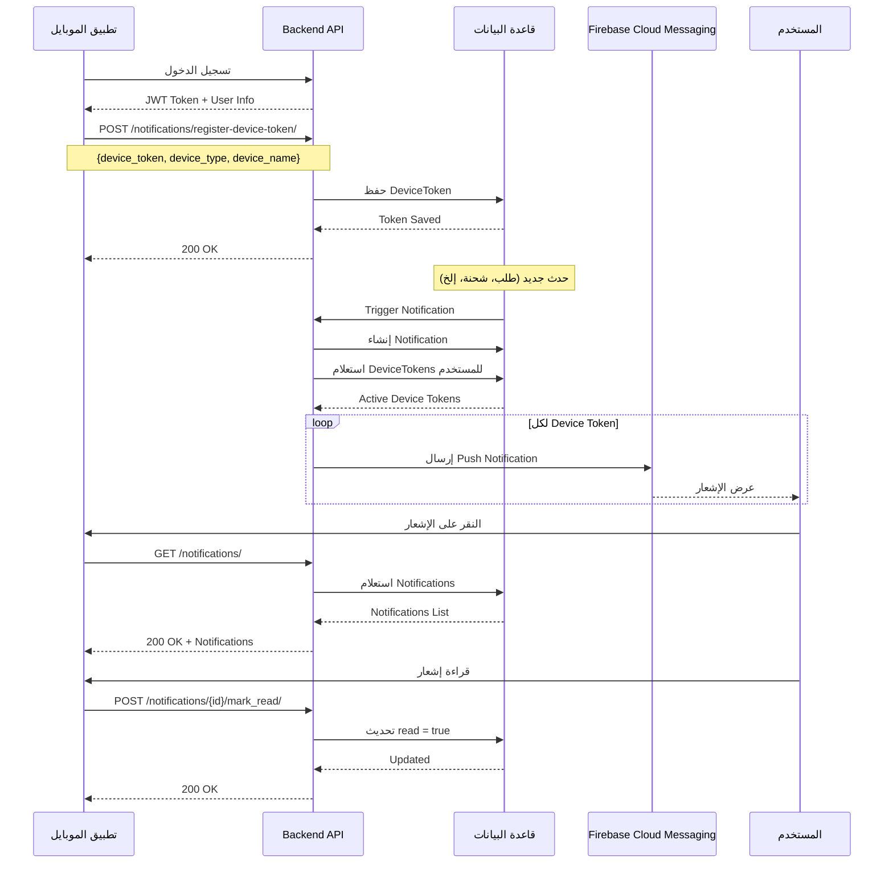

---

## 📊 Activity Diagrams {#activity-diagrams}

### 1️⃣ سير عمل طلب المدرسة {#activity-1}

```mermaid
flowchart TD
    Start([بداية]) --> Login[موظف المدرسة يسجل الدخول]
    Login --> CreateRequest[إنشاء طلب كتب جديد]
    CreateRequest --> AddItems[إضافة الكتب المطلوبة]
    AddItems --> MoreItems{هل توجد كتب أخرى؟}
    MoreItems -->|نعم| AddItems
    MoreItems -->|لا| SaveDraft[حفظ كمسودة]
    
    SaveDraft --> Review[مراجعة الطلب]
    Review --> CheckCorrect{هل البيانات صحيحة؟}
    CheckCorrect -->|لا| EditRequest[تعديل الطلب]
    EditRequest --> Review
    CheckCorrect -->|نعم| Submit[إرسال الطلب للمحافظة]
    
    Submit --> NotifyProvince[إشعار موظف المحافظة]
    NotifyProvince --> WaitApproval[انتظار الموافقة]
    
    WaitApproval --> ProvinceReview[موظف المحافظة يراجع]
    ProvinceReview --> CheckStock{التحقق من المخزون}
    
    CheckStock -->|غير متوفر| Reject[رفض الطلب]
    Reject --> NotifySchoolRejection[إشعار المدرسة بالرفض]
    NotifySchoolRejection --> EndRejected([نهاية - مرفوض])
    
    CheckStock -->|متوفر| Approve[اعتماد الطلب]
    Approve --> NotifySchoolApproval[إشعار المدرسة بالموافقة]
    NotifySchoolApproval --> CreateShipment[إنشاء شحنة]
    
    CreateShipment --> DeductInventory[خصم من المخزون]
    DeductInventory --> AssignCourier[تعيين مندوب]
    AssignCourier --> GenerateQR[إنشاء QR Code]
    GenerateQR --> NotifyCourier[إشعار المندوب]
    NotifyCourier --> CourierDelivery[المندوب يبدأ التوصيل]
    
    CourierDelivery --> ScanQR[مسح QR Code عند المدرسة]
    ScanQR --> ValidateQR{التحقق من QR Code}
    ValidateQR -->|غير صالح| ErrorQR[عرض خطأ]
    ErrorQR --> ScanQR
    ValidateQR -->|صالح| ConfirmDelivery[تأكيد التسليم]
    
    ConfirmDelivery --> UploadProof[رفع التوقيع والصورة]
    UploadProof --> UpdateStatus[تحديث حالة الشحنة]
    UpdateStatus --> NotifyAll[إشعار جميع الأطراف]
    NotifyAll --> EndSuccess([نهاية - تم التسليم])
    
    style Start fill:#90EE90
    style EndSuccess fill:#90EE90
    style EndRejected fill:#FFB6C1
    style Reject fill:#FFB6C1
    style Approve fill:#87CEEB
    style CreateShipment fill:#87CEEB
```

### 2️⃣ سير عمل طلب المحافظة من الوزارة {#activity-2}

```mermaid
flowchart TD
    Start([بداية]) --> CheckStock[موظف المحافظة يتحقق من المخزون]
    CheckStock --> LowStock{مخزون منخفض؟}
    
    LowStock -->|لا| Monitor[مراقبة المخزون]
    Monitor --> End1([نهاية])
    
    LowStock -->|نعم| Login[تسجيل الدخول]
    Login --> CreateBookRequest[إنشاء طلب كتب للوزارة]
    CreateBookRequest --> AddBooks[إضافة الكتب المطلوبة]
    AddBooks --> CalculateQuantity[حساب الكميات المطلوبة]
    CalculateQuantity --> AddNotes[إضافة ملاحظات]
    AddNotes --> Submit[إرسال الطلب للوزارة]
    
    Submit --> NotifyMinistry[إشعار موظف الوزارة]
    NotifyMinistry --> WaitReview[انتظار المراجعة]
    
    WaitReview --> MinistryReview[موظف الوزارة يراجع الطلب]
    MinistryReview --> CheckMinistryStock{التحقق من المخزون المركزي}
    
    CheckMinistryStock -->|غير كافي| MinistryReject[رفض الطلب]
    MinistryReject --> NotifyProvinceRejection[إشعار المحافظة بالرفض]
    NotifyProvinceRejection --> ProvinceReorder{إعادة الطلب؟}
    ProvinceReorder -->|نعم| CreateBookRequest
    ProvinceReorder -->|لا| EndRejected([نهاية - مرفوض])
    
    CheckMinistryStock -->|كافي| MinistryApprove[اعتماد الطلب]
    MinistryApprove --> NotifyProvinceApproval[إشعار المحافظة بالموافقة]
    NotifyProvinceApproval --> PrepareShipment[تجهيز الشحنة]
    
    PrepareShipment --> DeductMinistryStock[خصم من مخزون الوزارة]
    DeductMinistryStock --> CreateShipment[إنشاء شحنة]
    CreateShipment --> AssignMinistryCourier[تعيين مندوب الوزارة]
    AssignMinistryCourier --> GenerateTracking[إنشاء Tracking Code]
    GenerateTracking --> GenerateQR[إنشاء QR Code]
    GenerateQR --> NotifyCourier[إشعار المندوب]
    
    NotifyCourier --> CourierPickup[المندوب يستلم الشحنة]
    CourierPickup --> StartDelivery[بدء التوصيل]
    StartDelivery --> UpdateLocation[تحديث الموقع GPS]
    UpdateLocation --> ArrivedProvince[الوصول لمخزن المحافظة]
    
    ArrivedProvince --> ProvinceStaffScan[موظف المحافظة يمسح QR]
    ProvinceStaffScan --> ValidateQR{التحقق من QR}
    ValidateQR -->|غير صالح| ErrorQR[عرض خطأ]
    ErrorQR --> ProvinceStaffScan
    
    ValidateQR -->|صالح| ConfirmReceipt[تأكيد الاستلام]
    ConfirmReceipt --> AddToProvinceStock[إضافة للمخزون]
    AddToProvinceStock --> UpdateShipmentStatus[تحديث حالة الشحنة]
    UpdateShipmentStatus --> NotifyCompletion[إشعار جميع الأطراف]
    NotifyCompletion --> EndSuccess([نهاية - تمت الإضافة للمخزون])
    
    style Start fill:#90EE90
    style EndSuccess fill:#90EE90
    style EndRejected fill:#FFB6C1
    style MinistryReject fill:#FFB6C1
    style MinistryApprove fill:#87CEEB
    style AddToProvinceStock fill:#87CEEB
```

### 3️⃣ سير عمل المندوب (Courier Workflow) {#activity-3}

```mermaid
flowchart TD
    Start([بداية]) --> Login[المندوب يسجل الدخول]
    Login --> ViewShipments[عرض الشحنات المسندة]
    ViewShipments --> CheckShipments{توجد شحنات؟}
    
    CheckShipments -->|لا| Wait[انتظار تعيين شحنات]
    Wait --> Refresh[تحديث القائمة]
    Refresh --> ViewShipments
    
    CheckShipments -->|نعم| SelectShipment[اختيار شحنة]
    SelectShipment --> ViewDetails[عرض تفاصيل الشحنة]
    ViewDetails --> ViewQR[عرض QR Code]
    ViewQR --> ViewMap[عرض الموقع على الخريطة]
    
    ViewMap --> StartDeliveryAction[بدء التوصيل]
    StartDeliveryAction --> UpdateStatus[تحديث الحالة: قيد التوصيل]
    UpdateStatus --> NotifyRecipient[إشعار المستلم]
    
    NotifyRecipient --> EnableGPS[تفعيل تتبع GPS]
    EnableGPS --> NavigateLoop[التنقل للوجهة]
    
    NavigateLoop --> UpdateGPS[تحديث الموقع كل دقيقة]
    UpdateGPS --> CheckArrived{وصول للوجهة؟}
    CheckArrived -->|لا| NavigateLoop
    
    CheckArrived -->|نعم| ArriveNotify[إشعار بالوصول]
    ArriveNotify --> RequestScan[طلب مسح QR Code]
    
    RequestScan --> ScanQR[المستلم يمسح QR Code]
    ScanQR --> ValidateQR{التحقق من الصلاحية}
    
    ValidateQR -->|منتهي الصلاحية| ExpiredError[عرض خطأ QR منتهي]
    ExpiredError --> ContactSupport[التواصل مع الدعم]
    ContactSupport --> ManualVerify[التحقق اليدوي]
    ManualVerify --> ProceedDelivery
    
    ValidateQR -->|غير صحيح| InvalidError[عرض خطأ QR غير صحيح]
    InvalidError --> ScanQR
    
    ValidateQR -->|صالح| ProceedDelivery[المتابعة للتسليم]
    
    ProceedDelivery --> VerifyBooks[التحقق من الكتب]
    VerifyBooks --> CheckCondition{حالة الكتب جيدة؟}
    
    CheckCondition -->|تالفة| ReportDamage[الإبلاغ عن التلف]
    ReportDamage --> TakePhotos[التقاط صور]
    TakePhotos --> NotifyWarehouse[إشعار المخزن]
    NotifyWarehouse --> DecideAction{الإجراء؟}
    
    DecideAction -->|إرجاع| ReturnShipment[إرجاع الشحنة]
    ReturnShipment --> EndReturn([نهاية - تم الإرجاع])
    
    DecideAction -->|تسليم| ProceedWithDamage[التسليم مع التوثيق]
    ProceedWithDamage --> CollectSignature
    
    CheckCondition -->|جيدة| CollectSignature[جمع التوقيع الرقمي]
    
    CollectSignature --> TakeDeliveryPhoto[التقاط صورة التسليم]
    TakeDeliveryPhoto --> RecipientName[تسجيل اسم المستلم]
    RecipientName --> AddNotes[إضافة ملاحظات]
    AddNotes --> UploadProof[رفع البيانات للسيرفر]
    
    UploadProof --> CheckUpload{تم الرفع؟}
    CheckUpload -->|فشل| RetryUpload[إعادة المحاولة]
    RetryUpload --> CheckConnection{اتصال بالإنترنت؟}
    CheckConnection -->|لا| SaveOffline[حفظ محلياً]
    SaveOffline --> WaitConnection[انتظار الاتصال]
    WaitConnection --> UploadProof
    CheckConnection -->|نعم| UploadProof
    
    CheckUpload -->|نجح| ConfirmDelivery[تأكيد التسليم]
    ConfirmDelivery --> UpdateShipmentDB[تحديث قاعدة البيانات]
    UpdateShipmentDB --> NotifyAllParties[إشعار جميع الأطراف]
    
    NotifyAllParties --> RecordStats[تسجيل الإحصائيات]
    RecordStats --> CheckMoreShipments{شحنات أخرى؟}
    
    CheckMoreShipments -->|نعم| ViewShipments
    CheckMoreShipments -->|لا| EndSuccess([نهاية - إنجاز اليوم])
    
    style Start fill:#90EE90
    style EndSuccess fill:#90EE90
    style EndReturn fill:#FFD700
    style ReportDamage fill:#FFA500
    style CollectSignature fill:#87CEEB
    style ConfirmDelivery fill:#87CEEB
```

### 4️⃣ سير عمل نظام الإشعارات {#activity-4}

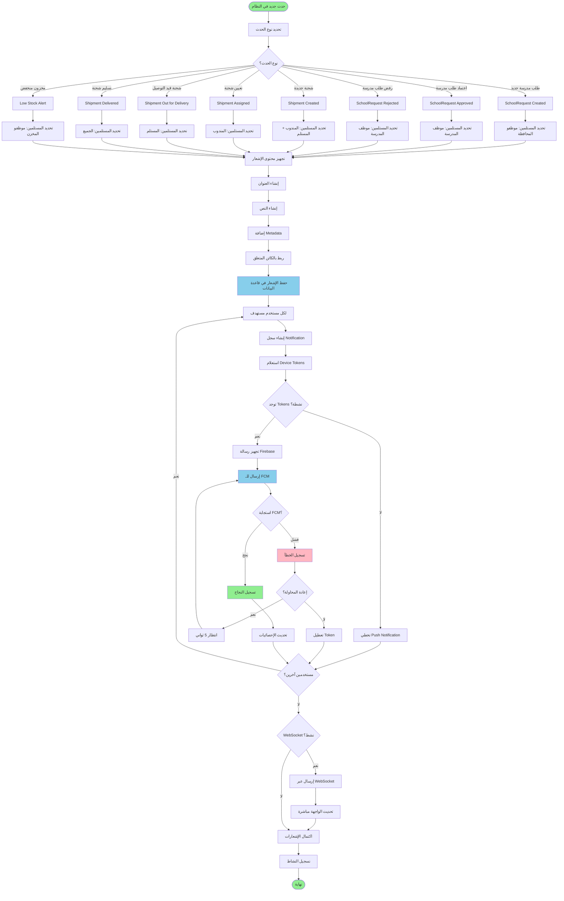

### 5️⃣ إدارة المخزون والتنبيهات {#activity-5}

```mermaid
flowchart TD
    Start([بداية]) --> DailyCheck[فحص يومي للمخزون]
    DailyCheck --> QueryStock[استعلام جميع WarehouseStock]
    QueryStock --> LoopItems[لكل عنصر في المخزون]
    
    LoopItems --> CheckQuantity{الكمية < Min Threshold؟}
    
    CheckQuantity -->|لا| Normal[مخزون طبيعي]
    Normal --> NextItem1
    
    CheckQuantity -->|نعم| LowStock[مخزون منخفض]
    LowStock --> MarkLowStock[وضع علامة Low Stock]
    MarkLowStock --> GetWarehouseStaff[الحصول على موظفي المخزن]
    
    GetWarehouseStaff --> CreateAlert[إنشاء تنبيه]
    CreateAlert --> NotifyStaff[إشعار الموظفين]
    NotifyStaff --> CheckCritical{كمية حرجة < 5؟}
    
    CheckCritical -->|نعم| UrgentNotification[إشعار عاجل]
    UrgentNotification --> NotifyAdmin[إشعار المدير]
    NotifyAdmin --> AutoCreateRequest{إنشاء طلب تلقائي؟}
    
    AutoCreateRequest -->|نعم| CreateAutoRequest[إنشاء طلب تجديد تلقائي]
    CreateAutoRequest --> CalculateNeeded[حساب الكمية المطلوبة]
    CalculateNeeded --> SubmitRequest[إرسال الطلب]
    SubmitRequest --> NextItem1
    
    AutoCreateRequest -->|لا| NextItem1
    CheckCritical -->|لا| NextItem1
    
    NextItem1{عناصر أخرى؟} -->|نعم| LoopItems
    NextItem1 -->|لا| GenerateReport[إنشاء تقرير يومي]
    
    GenerateReport --> ShipmentEvent[حدث شحنة جديدة]
    ShipmentEvent --> CheckShipmentType{نوع الشحنة؟}
    
    CheckShipmentType -->|وارد للمخزن| IncomingShipment[شحنة واردة]
    CheckShipmentType -->|صادر من المخزن| OutgoingShipment[شحنة صادرة]
    
    IncomingShipment --> WaitDelivery[انتظار التسليم]
    WaitDelivery --> ConfirmReceived[تأكيد الاستلام]
    ConfirmReceived --> AddInventory[إضافة للمخزون]
    
    AddInventory --> UpdateQuantity1[تحديث الكمية: quantity += amount]
    UpdateQuantity1 --> LogTransaction1[تسجيل المعاملة]
    LogTransaction1 --> CheckAfterAdd{بعد الإضافة >= Threshold؟}
    
    CheckAfterAdd -->|نعم| RemoveLowStockFlag[إزالة علامة Low Stock]
    RemoveLowStockFlag --> NotifyNormal[إشعار: المخزون عاد للطبيعي]
    NotifyNormal --> UpdateReports1
    
    CheckAfterAdd -->|لا| StillLow[لا يزال منخفضاً]
    StillLow --> UpdateReports1
    
    OutgoingShipment --> VerifyAvailability[التحقق من التوفر]
    VerifyAvailability --> CheckAvailable{الكمية متوفرة؟}
    
    CheckAvailable -->|لا| InsufficientStock[مخزون غير كافٍ]
    InsufficientStock --> CancelShipment[إلغاء الشحنة]
    CancelShipment --> NotifyInsufficientStock[إشعار بعدم الكفاية]
    NotifyInsufficientStock --> End1([نهاية - ملغاة])
    
    CheckAvailable -->|نعم| DeductInventory[خصم من المخزون]
    DeductInventory --> UpdateQuantity2[تحديث الكمية: quantity -= amount]
    UpdateQuantity2 --> CheckAfterDeduct{بعد الخصم < Threshold؟}
    
    CheckAfterDeduct -->|نعم| SetLowStockFlag[وضع علامة Low Stock]
    SetLowStockFlag --> NotifyLowAfterDeduct[إشعار: مخزون منخفض]
    NotifyLowAfterDeduct --> CheckAutoOrder{طلب تلقائي مفعّل؟}
    
    CheckAutoOrder -->|نعم| TriggerAutoOrder[تفعيل طلب تلقائي]
    TriggerAutoOrder --> UpdateReports2
    CheckAutoOrder -->|لا| UpdateReports2
    
    CheckAfterDeduct -->|لا| UpdateReports2[تحديث التقارير]
    
    UpdateReports1 --> LogTransaction2[تسجيل جميع المعاملات]
    UpdateReports2 --> LogTransaction2
    
    LogTransaction2 --> UpdateDashboard[تحديث Dashboard]
    UpdateDashboard --> CacheStatistics[تخزين الإحصائيات مؤقتاً]
    CacheStatistics --> EndSuccess([نهاية - تم التحديث])
    
    style Start fill:#90EE90
    style EndSuccess fill:#90EE90
    style End1 fill:#FFB6C1
    style LowStock fill:#FFA500
    style UrgentNotification fill:#FF6347
    style AddInventory fill:#87CEEB
    style DeductInventory fill:#FFD700
```

---

## 📝 ملاحظات تحديث الملف {#update-notes}

### آخر تحديث: 17 يناير 2026

#### ✅ الميزات المُنجزة والمستخدمة:
1. **نظام طلبات المدارس الكامل** - مع جميع الحالات والتحويلات
2. **نظام إنشاء الشحنات من الطلبات** - مباشرة من طلبات المدارس المعتمدة
3. **نظام الشحنات (Ministry ↔ Province ↔ School)**
4. **نظام المندوبين والتوصيل** - مع QR Code والتوقيع الرقمي
5. **نظام الإشعارات** - Firebase FCM + WebSocket
6. **نظام المخزون** - مع التنبيهات التلقائية
7. **لوحة التحكم الويب** - لموظفي المحافظة والوزارة
8. **تطبيق الموبايل** - للمندوبين والمدارس (Flutter)

#### 📊 ملخص الحقول والعلاقات:

**ProvinceToSchoolShipment:**
- `tracking_code` - كود التتبع الفريد
- `qr_token` + `qr_code_image` - رمز QR والصورة
- `status` - pending, assigned, out_for_delivery, delivered
- `related_school_request` - ربط بالطلب الأصلي ✅ **جديد**
- `delivered_at` - تاريخ التسليم الفعلي
- `delivery_notes` - ملاحظات التسليم

**WarehouseStock:**
- دعم المخزن المركزي والمحافظة معاً
- Automatic deduction on shipment creation ✅
- Low stock alerts ✅

#### 🔌 API Endpoints الرئيسية:

**School Requests:**
- `GET /school-requests/` - عرض الطلبات
- `POST /school-requests/` - إنشاء طلب
- `GET /school-requests/{id}/approve/` - اعتماد الطلب

**Shipments (Province):**
- `GET /warehouses/province/school-requests/approved/` - الطلبات المعتمدة
- `POST /warehouses/province/shipments/create-from-request/` - إنشاء شحنة

**Shipment Management:**
- `POST /warehouses/shipments/{id}/start-delivery/` - بدء التوصيل
- `POST /warehouses/scan-qr/` - مسح QR Code
- `POST /warehouses/confirm-delivery/{id}/` - تأكيد التسليم

**Notifications:**
- `POST /notifications/register-device-token/` - تسجيل جهاز
- `GET /notifications/` - عرض الإشعارات
- `POST /notifications/{id}/mark_read/` - قراءة الإشعار

---
