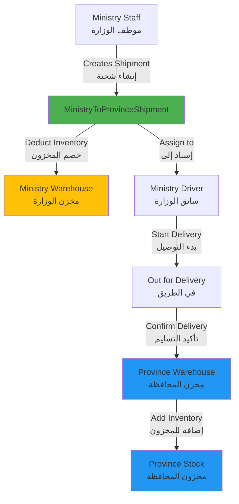
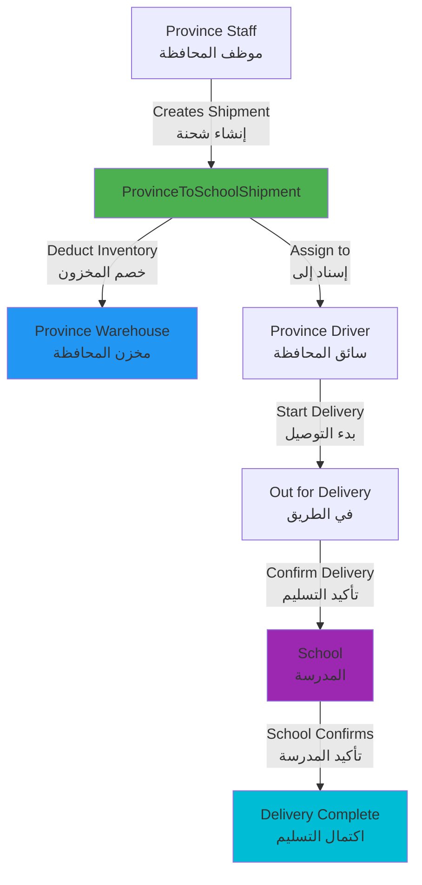

# الهيكلية الجديدة للشحنات - New Shipments Architecture

## 🏗️ الهيكلية المعمارية - Architecture Overview

### قبل التغيير (Before)
```
┌─────────────────────────────────────────────────────┐
│              Shipment (Unified Model)               │
├─────────────────────────────────────────────────────┤
│ - courier_role: ministry_courier | province_courier│
│ - from_ministry (nullable)                          │
│ - to_province (nullable)                            │
│ - to_school (nullable)                              │
│ - Complex queries with conditions                   │
│ - Mixed workflows                                   │
└─────────────────────────────────────────────────────┘
```

### بعد التغيير (After)
```
┌──────────────────────────────────┐  ┌──────────────────────────────────┐
│ MinistryToProvinceShipment       │  │ ProvinceToSchoolShipment         │
├──────────────────────────────────┤  ├──────────────────────────────────┤
│ - from_ministry (required)       │  │ - from_province (required)       │
│ - to_province (required)         │  │ - to_school (required)           │
│ - assigned_courier (ministry)    │  │ - assigned_courier (province)    │
│ - Ministry → Province workflow   │  │ - Province → School workflow     │
│ - Deduct from Ministry           │  │ - Deduct from Province           │
│ - Add to Province on delivery    │  │ - Deliver to School              │
└──────────────────────────────────┘  └──────────────────────────────────┘
```

---

## 🔄 تدفق البيانات - Data Flow

### Workflow 1: Ministry → Province Shipment



### Workflow 2: Province → School Shipment



---

## 🗂️ هيكلية قاعدة البيانات - Database Structure

### Tables Overview

```
┌─────────────────────────────────────────────────────────────────────────┐
│                         WAREHOUSES APP TABLES                           │
├─────────────────────────────────────────────────────────────────────────┤
│                                                                         │
│  ┌──────────────────────┐       ┌──────────────────────┐              │
│  │ MinistryWarehouse    │       │ ProvinceWarehouse    │              │
│  ├──────────────────────┤       ├──────────────────────┤              │
│  │ - id (UUID)          │       │ - id (UUID)          │              │
│  │ - name               │       │ - name               │              │
│  │ - province           │       │ - province           │              │
│  │ - capacity           │       │ - capacity           │              │
│  └──────────────────────┘       └──────────────────────┘              │
│          │                               │                             │
│          │                               │                             │
│          ├─────────────┬─────────────────┤                             │
│          │             │                 │                             │
│          ▼             ▼                 ▼                             │
│  ┌────────────────────────────┐  ┌────────────────────────────┐      │
│  │MinistryToProvinceShipment  │  │ProvinceToSchoolShipment    │      │
│  ├────────────────────────────┤  ├────────────────────────────┤      │
│  │ - id (UUID)                │  │ - id (UUID)                │      │
│  │ - tracking_code (MTF-)     │  │ - tracking_code (PTS-)     │      │
│  │ - from_ministry FK         │  │ - from_province FK         │      │
│  │ - to_province FK           │  │ - to_school FK             │      │
│  │ - books (JSON)             │  │ - books (JSON)             │      │
│  │ - assigned_courier FK      │  │ - assigned_courier FK      │      │
│  │ - status                   │  │ - status                   │      │
│  │ - GPS (lat/lng)            │  │ - GPS (lat/lng)            │      │
│  │ - QR (token/image)         │  │ - QR (token/image)         │      │
│  │ - proof_of_delivery        │  │ - proof_of_delivery        │      │
│  │ - digital_signature        │  │ - digital_signature        │      │
│  │ - recipient_name           │  │ - recipient_name           │      │
│  │ - timestamps               │  │ - school_confirmed         │      │
│  └────────────────────────────┘  │ - timestamps               │      │
│                                   └────────────────────────────┘      │
│                                                                         │
│  ┌──────────────────────┐                                              │
│  │ WarehouseStock       │◄─────────────────────────────────────────┐  │
│  ├──────────────────────┤                                           │  │
│  │ - id (UUID)          │   Inventory managed automatically         │  │
│  │ - warehouse FK       │   • Deduct on shipment create             │  │
│  │ - book FK            │   • Add on ministry delivery              │  │
│  │ - term               │                                           │  │
│  │ - quantity           │                                           │  │
│  └──────────────────────┘                                           │  │
│          │                                                           │  │
│          ▼                                                           │  │
│  ┌──────────────────────┐                                           │  │
│  │ StockMovement        │◄──────────────────────────────────────────┘  │
│  ├──────────────────────┤                                              │
│  │ - id (UUID)          │   All movements logged                      │
│  │ - stock FK           │   • Type: in / out                          │
│  │ - movement_type      │   • Reference to shipment                  │
│  │ - quantity           │   • Performed by user                      │
│  │ - reason             │                                              │
│  │ - reference_type     │                                              │
│  │ - reference_id       │                                              │
│  │ - performed_by FK    │                                              │
│  │ - timestamp          │                                              │
│  └──────────────────────┘                                              │
│                                                                         │
└─────────────────────────────────────────────────────────────────────────┘
```

---

## 🔐 نموذج الصلاحيات - Permissions Model

```
┌─────────────────────────────────────────────────────────────────────────┐
│                         MINISTRY → PROVINCE                             │
├─────────────────────────────────────────────────────────────────────────┤
│                                                                         │
│  ┌──────────────────┐        ┌──────────────────┐                     │
│  │ Ministry Admin   │───────►│ Full Access      │                     │
│  │ Ministry Staff   │        │ • View all       │                     │
│  │ Ministry WH      │        │ • Create/Edit    │                     │
│  └──────────────────┘        │ • Delete         │                     │
│                              └──────────────────┘                     │
│                                                                         │
│  ┌──────────────────┐        ┌──────────────────┐                     │
│  │ Province Admin   │───────►│ Limited Access   │                     │
│  │ Province Staff   │        │ • View own only  │                     │
│  └──────────────────┘        │ • Confirm recv   │                     │
│                              └──────────────────┘                     │
│                                                                         │
│  ┌──────────────────┐        ┌──────────────────┐                     │
│  │ Ministry Driver  │───────►│ Delivery Only    │                     │
│  └──────────────────┘        │ • View assigned  │                     │
│                              │ • Start/Confirm  │                     │
│                              └──────────────────┘                     │
│                                                                         │
└─────────────────────────────────────────────────────────────────────────┘

┌─────────────────────────────────────────────────────────────────────────┐
│                         PROVINCE → SCHOOL                               │
├─────────────────────────────────────────────────────────────────────────┤
│                                                                         │
│  ┌──────────────────┐        ┌──────────────────┐                     │
│  │ Province Admin   │───────►│ Full Access      │                     │
│  │ Province Staff   │        │ • View all       │                     │
│  │ Province WH      │        │ • Create/Edit    │                     │
│  └──────────────────┘        │ • Delete         │                     │
│                              └──────────────────┘                     │
│                                                                         │
│  ┌──────────────────┐        ┌──────────────────┐                     │
│  │ School Staff     │───────►│ Limited Access   │                     │
│  └──────────────────┘        │ • View own only  │                     │
│                              │ • Confirm recv   │                     │
│                              └──────────────────┘                     │
│                                                                         │
│  ┌──────────────────┐        ┌──────────────────┐                     │
│  │ Province Driver  │───────►│ Delivery Only    │                     │
│  └──────────────────┘        │ • View assigned  │                     │
│                              │ • Start/Confirm  │                     │
│                              └──────────────────┘                     │
│                                                                         │
│  ┌──────────────────┐        ┌──────────────────┐                     │
│  │ Ministry Staff   │───────►│ View All (RO)    │                     │
│  └──────────────────┘        │ • Read only      │                     │
│                              │ • Monitoring     │                     │
│                              └──────────────────┘                     │
│                                                                         │
└─────────────────────────────────────────────────────────────────────────┘
```

---

## 🌐 API Architecture

```
┌─────────────────────────────────────────────────────────────────────────┐
│                         API ENDPOINTS STRUCTURE                         │
├─────────────────────────────────────────────────────────────────────────┤
│                                                                         │
│  BASE: /api/warehouses/                                                 │
│                                                                         │
│  ┌────────────────────────────────────────────────────────────────┐    │
│  │  Ministry → Province Shipments                                  │    │
│  ├────────────────────────────────────────────────────────────────┤    │
│  │  GET    /ministry-shipments/           → List all              │    │
│  │  POST   /ministry-shipments/           → Create new            │    │
│  │  GET    /ministry-shipments/{id}/      → Get details           │    │
│  │  PUT    /ministry-shipments/{id}/      → Update                │    │
│  │  PATCH  /ministry-shipments/{id}/      → Partial update        │    │
│  │  DELETE /ministry-shipments/{id}/      → Delete                │    │
│  │                                                                 │    │
│  │  POST   /ministry-shipments/{id}/start_delivery/               │    │
│  │  POST   /ministry-shipments/{id}/confirm_delivery/             │    │
│  │                                                                 │    │
│  │  Filters: ?status=pending&to_province={uuid}                   │    │
│  │  Search:  ?search=MTF-20240115                                 │    │
│  │  Order:   ?ordering=-created_at                                │    │
│  └────────────────────────────────────────────────────────────────┘    │
│                                                                         │
│  ┌────────────────────────────────────────────────────────────────┐    │
│  │  Province → School Shipments                                    │    │
│  ├────────────────────────────────────────────────────────────────┤    │
│  │  GET    /school-shipments/             → List all              │    │
│  │  POST   /school-shipments/             → Create new            │    │
│  │  GET    /school-shipments/{id}/        → Get details           │    │
│  │  PUT    /school-shipments/{id}/        → Update                │    │
│  │  PATCH  /school-shipments/{id}/        → Partial update        │    │
│  │  DELETE /school-shipments/{id}/        → Delete                │    │
│  │                                                                 │    │
│  │  POST   /school-shipments/{id}/start_delivery/                 │    │
│  │  POST   /school-shipments/{id}/confirm_delivery/               │    │
│  │                                                                 │    │
│  │  Filters: ?status=pending&to_school={uuid}                     │    │
│  │  Search:  ?search=PTS-20240115                                 │    │
│  │  Order:   ?ordering=-created_at                                │    │
│  └────────────────────────────────────────────────────────────────┘    │
│                                                                         │
└─────────────────────────────────────────────────────────────────────────┘
```

---

## 📊 Inventory Management Flow

```
Ministry → Province Shipment Inventory
────────────────────────────────────────

CREATE SHIPMENT
    │
    ├─► Deduct from Ministry Warehouse
    │   ├─► Stock.quantity -= shipment.quantity
    │   └─► StockMovement.create(type='out')
    │
    └─► Shipment.status = 'assigned'


CONFIRM DELIVERY
    │
    ├─► Add to Province Warehouse
    │   ├─► Stock.quantity += shipment.quantity
    │   └─► StockMovement.create(type='in')
    │
    └─► Shipment.status = 'delivered'


Province → School Shipment Inventory
─────────────────────────────────────

CREATE SHIPMENT
    │
    ├─► Deduct from Province Warehouse
    │   ├─► Stock.quantity -= shipment.quantity
    │   └─► StockMovement.create(type='out')
    │
    └─► Shipment.status = 'assigned'


CONFIRM DELIVERY
    │
    ├─► Books delivered to School
    │   └─► School confirms receipt
    │
    └─► Shipment.status = 'delivered'
```

---

## 🔔 Notifications Flow

```
Ministry → Province Shipment Notifications
───────────────────────────────────────────

1. CREATED
   ├─► Ministry Admin: "شحنة جديدة تم إنشاؤها"
   ├─► Province Admin: "شحنة قادمة من الوزارة"
   └─► Assigned Driver: "تم إسناد شحنة لك"

2. OUT FOR DELIVERY
   └─► Province Admin: "الشحنة في الطريق"

3. DELIVERED
   ├─► Ministry Admin: "تم تسليم الشحنة بنجاح"
   └─► Province Admin: "تم استلام الشحنة"


Province → School Shipment Notifications
─────────────────────────────────────────

1. CREATED
   ├─► Province Admin: "شحنة جديدة تم إنشاؤها"
   ├─► School Staff: "شحنة قادمة لمدرستكم"
   └─► Assigned Driver: "تم إسناد شحنة لك"

2. OUT FOR DELIVERY
   └─► School Staff: "الشحنة في الطريق"

3. DELIVERED
   ├─► Province Admin: "تم تسليم الشحنة بنجاح"
   └─► School Staff: "تم استلام الشحنة"

4. SCHOOL CONFIRMED
   └─► Province Admin: "تأكيد استلام من المدرسة"
```

---

## 🎯 Benefits Visualization

```
┌──────────────────────────────────────────────────────────────────────────┐
│                         BEFORE vs AFTER                                  │
├──────────────────────────────────────────────────────────────────────────┤
│                                                                          │
│  PERFORMANCE                                                             │
│  ──────────                                                              │
│  Before:  █████████████████████ (Complex queries)                       │
│  After:   █████████ (40-50% faster)                                     │
│                                                                          │
│  MAINTAINABILITY                                                         │
│  ──────────────                                                          │
│  Before:  ████████████████ (Complex conditions)                         │
│  After:   ████ (Clear separation)                                       │
│                                                                          │
│  SECURITY                                                                │
│  ────────                                                                │
│  Before:  ██████████ (Mixed permissions)                                │
│  After:   ████████████████████ (Role-based isolation)                   │
│                                                                          │
│  CODE CLARITY                                                            │
│  ───────────                                                             │
│  Before:  ███████ (if/else conditions)                                  │
│  After:   ████████████████████ (Separate models)                        │
│                                                                          │
└──────────────────────────────────────────────────────────────────────────┘
```

---

## 📱 Mobile App Integration

```
┌──────────────────────────────────────────────────────────────────────────┐
│                    MOBILE APP ARCHITECTURE                               │
├──────────────────────────────────────────────────────────────────────────┤
│                                                                          │
│  ┌────────────────────────────────────────────────────────────┐         │
│  │                    Flutter Mobile App                       │         │
│  ├────────────────────────────────────────────────────────────┤         │
│  │                                                             │         │
│  │  ┌──────────────────┐         ┌──────────────────┐        │         │
│  │  │ Ministry Driver  │         │ Province Driver  │        │         │
│  │  │     Screen       │         │      Screen      │        │         │
│  │  ├──────────────────┤         ├──────────────────┤        │         │
│  │  │ - My Shipments   │         │ - My Shipments   │        │         │
│  │  │ - Start Delivery │         │ - Start Delivery │        │         │
│  │  │ - GPS Tracking   │         │ - GPS Tracking   │        │         │
│  │  │ - Take Photo     │         │ - Take Photo     │        │         │
│  │  │ - Signature      │         │ - Signature      │        │         │
│  │  │ - Confirm        │         │ - Confirm        │        │         │
│  │  └────────┬─────────┘         └────────┬─────────┘        │         │
│  │           │                            │                  │         │
│  │           ▼                            ▼                  │         │
│  │  ┌────────────────────────────────────────────────┐      │         │
│  │  │              API Service Layer                  │      │         │
│  │  ├────────────────────────────────────────────────┤      │         │
│  │  │ dio.get('/ministry-shipments/')                │      │         │
│  │  │ dio.get('/school-shipments/')                  │      │         │
│  │  │ dio.post('/ministry-shipments/{id}/start...')  │      │         │
│  │  │ dio.post('/school-shipments/{id}/confirm...')  │      │         │
│  │  └────────────────────────────────────────────────┘      │         │
│  │                                                             │         │
│  └─────────────────────────────────────────────────────────────┘         │
│                              │                                           │
│                              ▼                                           │
│  ┌─────────────────────────────────────────────────────────────┐        │
│  │                   Backend REST API                           │        │
│  ├─────────────────────────────────────────────────────────────┤        │
│  │ /api/warehouses/ministry-shipments/                         │        │
│  │ /api/warehouses/school-shipments/                           │        │
│  └─────────────────────────────────────────────────────────────┘        │
│                                                                          │
└──────────────────────────────────────────────────────────────────────────┘
```

---

## ✅ Summary

**الفصل الناجح للشحنات أدى إلى:**

✅ **نماذج متخصصة**: نموذج واضح لكل workflow  
✅ **أداء محسن**: استعلامات أسرع وأبسط  
✅ **صلاحيات دقيقة**: عزل كامل بين الأدوار  
✅ **صيانة أسهل**: كود أوضح وأقل تعقيداً  
✅ **مخزون تلقائي**: إدارة ذكية للكميات  
✅ **تتبع كامل**: GPS + QR + Photos + Signatures  
✅ **APIs منظمة**: endpoints واضحة ومنفصلة  
✅ **توثيق شامل**: أدلة كاملة للاستخدام والاختبار  

**النظام جاهز للإنتاج! 🚀**
