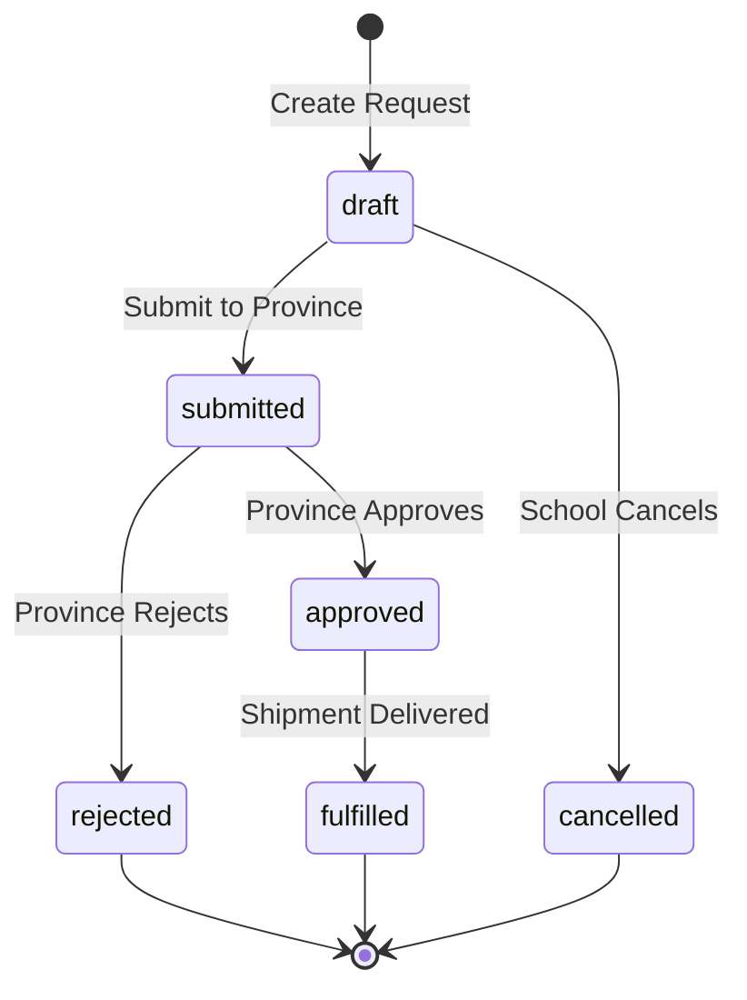
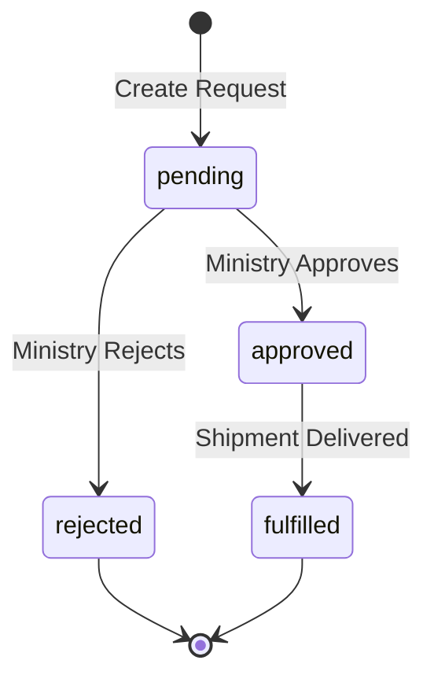
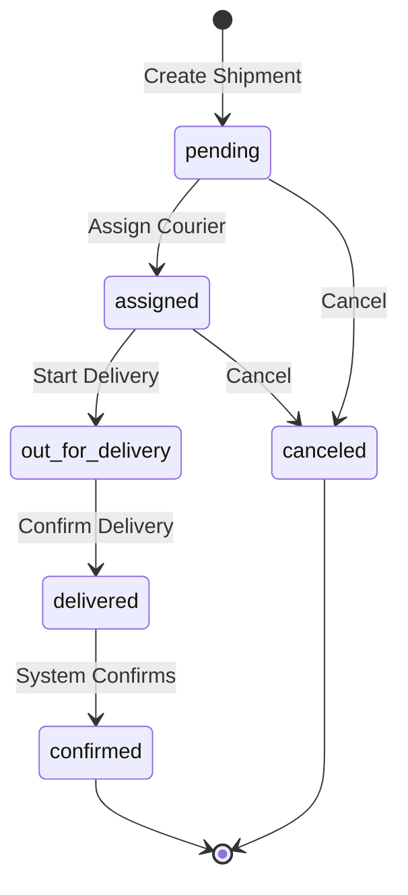

# تحليل شامل للعمليات - نظام توزيع الكتب المدرسية Ketabi
## Comprehensive System Operations Analysis

---

## 📋 فهرس المحتويات

1. [نظرة عامة على النظام](#overview)
2. [الأدوار والصلاحيات](#roles)
3. [العمليات الرئيسية](#main-operations)
4. [تفاصيل سير العمل](#workflows)
5. [التقنيات المستخدمة](#technologies)
6. [قاعدة البيانات](#database)

---

## 🎯 نظرة عامة على النظام {#overview}

### الهدف من المشروع
نظام إلكتروني متكامل لإدارة وتوزيع الكتب المدرسية في اليمن، يربط بين:
- **وزارة التربية والتعليم** (المخزن المركزي)
- **المحافظات** (مخازن المحافظات)
- **المدارس** (المستفيد النهائي)
- **المناديب** (التوصيل والنقل)

### المشكلة التي يحلها النظام
1. **عدم الشفافية**: صعوبة تتبع الطلبات والشحنات
2. **هدر الموارد**: نقص معلومات عن المخزون الفعلي
3. **تأخير التوزيع**: عدم وجود نظام آلي لتنسيق التوصيل
4. **ضعف التواصل**: عدم وجود إشعارات فورية للأطراف المعنية
5. **صعوبة التقارير**: غياب إحصائيات دقيقة وفورية

### الحل المقدم
نظام ويب متكامل + تطبيق موبايل يوفر:
- ✅ تتبع لحظي للطلبات والشحنات
- ✅ إدارة ذكية للمخزون مع تنبيهات تلقائية
- ✅ QR Code للتحقق من الشحنات
- ✅ إشعارات فورية (Push Notifications)
- ✅ تقارير تفصيلية وإحصائيات
- ✅ تتبع GPS للمناديب
- ✅ توقيع رقمي وإثبات التسليم

---

## 👥 الأدوار والصلاحيات {#roles}

### 1. Admin (المدير العام)
**الصلاحيات:**
- إدارة جميع المستخدمين
- إضافة وتعديل الكتب
- الوصول لجميع التقارير
- إدارة المحافظات والمديريات
- إدارة المخازن

**Use Cases:**
- إنشاء مستخدمين جدد
- تعيين الأدوار
- مراقبة النظام بالكامل

---

### 2. Ministry Admin (مدير الوزارة)
**الصلاحيات:**
- إدارة موظفي الوزارة
- مراجعة طلبات المحافظات
- اعتماد/رفض الطلبات
- مراقبة المخزون المركزي
- عرض تقارير شاملة

**Use Cases:**
- مراجعة طلبات BookRequest من المحافظات
- اعتماد الطلبات المناسبة
- رفض الطلبات مع سبب الرفض
- مراقبة أداء المحافظات

---

### 3. Ministry Staff (موظف الوزارة)
**الصلاحيات:**
- مراجعة طلبات الكتب من المحافظات
- إنشاء شحنات للمحافظات
- إدارة المخزون المركزي
- تعيين مناديب الوزارة

**العمليات اليومية:**
1. **صباحاً:**
   - فحص الطلبات الجديدة من المحافظات
   - مراجعة حالة المخزون
   
2. **معالجة الطلبات:**
   - فتح طلب جديد (BookRequest)
   - التحقق من توفر الكتب في المخزون
   - اعتماد أو رفض الطلب
   - إنشاء شحنة عند الاعتماد
   
3. **إدارة الشحنات:**
   - تعيين مندوب للشحنة
   - إنشاء QR Code
   - متابعة حالة التوصيل

**Use Cases:**
- `GET /book-requests/?status=pending` - عرض الطلبات المعلقة
- `POST /book-requests/{id}/approve/` - اعتماد طلب
- `POST /book-requests/{id}/reject/` - رفض طلب
- `POST /warehouses/shipments/` - إنشاء شحنة جديدة
- `GET /warehouses/ministry-stock/` - عرض المخزون

---

### 4. Ministry Warehouse (موظف مخازن الوزارة)
**الصلاحيات:**
- إدارة المخزون المركزي
- إضافة وخصم الكميات
- تجهيز الشحنات
- مراقبة المخزون المنخفض

**العمليات:**
1. **إدارة المخزون:**
   - إضافة كميات جديدة من الكتب
   - خصم الكميات عند الشحن
   - مراقبة الكميات الدنيا (min_threshold)
   
2. **تجهيز الشحنات:**
   - استلام أمر الشحن
   - تجهيز الكتب المطلوبة
   - التحقق من الكميات
   - تسليم للمندوب

**Use Cases:**
- `POST /warehouses/ministry-stock/add/` - إضافة كمية
- `POST /warehouses/ministry-stock/deduct/` - خصم كمية
- `GET /warehouses/low-stock/` - عرض المخزون المنخفض

---

### 5. Ministry Driver (مندوب توصيل الوزارة)
**الصلاحيات:**
- عرض الشحنات المسندة له
- بدء التوصيل
- تحديث الموقع GPS
- تأكيد التسليم للمحافظة

**سير العمل اليومي:**

```
1. تسجيل الدخول للتطبيق (Mobile)
   └─> POST /users/login/

2. عرض الشحنات المسندة
   └─> GET /warehouses/shipments/?assigned_courier={id}&status=assigned

3. استلام الشحنة من المخزن
   └─> التحقق من الكمية والكتب
   └─> POST /warehouses/shipments/{id}/start-delivery/

4. التوجه للمحافظة
   └─> تفعيل GPS Tracking
   └─> Update location every minute

5. الوصول لمخزن المحافظة
   └─> إشعار موظف المحافظة
   └─> عرض QR Code للمسح

6. تأكيد الاستلام من المحافظة
   └─> موظف المحافظة يمسح QR
   └─> POST /warehouses/scan-qr/
   └─> POST /warehouses/confirm-delivery/{id}/
   
7. إكمال التسليم
   └─> توقيع رقمي + صورة
   └─> رفع للسيرفر
   └─> تحديث حالة الشحنة → delivered
```

**Use Cases:**
- عرض الشحنات المسندة
- بدء التوصيل
- تحديث الموقع
- مسح QR Code
- تأكيد التسليم

---

### 6. Province Admin (مدير المحافظة)
**الصلاحيات:**
- إدارة موظفي المحافظة
- مراجعة جميع العمليات
- الموافقة على طلبات الكتب للوزارة
- عرض تقارير المحافظة

**Use Cases:**
- إدارة المستخدمين
- مراقبة الأداء
- اتخاذ القرارات الإدارية

---

### 7. Province Staff (موظف المحافظة)
**الصلاحيات:**
- مراجعة طلبات المدارس
- اعتماد/رفض طلبات المدارس
- إنشاء طلبات للوزارة
- إنشاء شحنات للمدارس
- إدارة مخزون المحافظة
- تعيين مناديب المحافظة

**سير العمل التفصيلي:**

#### أ) معالجة طلبات المدارس

```
1. استقبال طلب جديد من مدرسة
   └─> إشعار: "طلب جديد من مدرسة الأمل"
   └─> GET /school-requests/?status=submitted

2. مراجعة الطلب
   └─> GET /school-requests/{id}/
   └─> عرض تفاصيل الطلب:
       - المدرسة
       - الكتب المطلوبة
       - الكميات
       - التيرم

3. التحقق من المخزون
   └─> GET /warehouses/province-stock/?book_id={id}
   └─> foreach كتاب في الطلب:
       - التحقق من توفر الكمية
       - إذا غير متوفر → رفض أو تقليل الكمية

4. اتخاذ القرار:
   
   أ) الاعتماد:
   └─> POST /school-requests/{id}/approve/
   └─> إشعار المدرسة بالموافقة
   └─> إنشاء شحنة تلقائياً أو يدوياً
   
   ب) الرفض:
   └─> POST /school-requests/{id}/reject/
   └─> body: {reason_rejected: "المخزون غير كافٍ"}
   └─> إشعار المدرسة بسبب الرفض
```

#### ب) إنشاء طلب للوزارة

```
1. فحص المخزون
   └─> GET /warehouses/province-stock/low-stock/
   └─> تحديد الكتب المنخفضة

2. إنشاء طلب كتب للوزارة
   └─> POST /book-requests/
   └─> body: {
       province: "أمانة العاصمة",
       items: [
         {book: 10, quantity: 500, term: "first"},
         {book: 15, quantity: 300, term: "second"}
       ],
       notes: "المخزون منخفض جداً - عاجل"
   }

3. متابعة الطلب
   └─> GET /book-requests/{id}/
   └─> انتظار رد الوزارة
   
4. عند الموافقة
   └─> إشعار: "تم اعتماد طلبك من الوزارة"
   └─> انتظار وصول الشحنة

5. استلام الشحنة من الوزارة
   └─> مسح QR Code
   └─> POST /warehouses/scan-qr/
   └─> تأكيد الاستلام
   └─> POST /warehouses/confirm-delivery/{id}/
   └─> إضافة تلقائية للمخزون
```

#### ج) إنشاء شحنة للمدرسة

```
1. بعد اعتماد طلب المدرسة
   └─> POST /warehouses/create-shipment-from-school-request/
   └─> body: {
       school_request_id: 123,
       assigned_courier_id: 7,
       delivery_notes: "توصيل عاجل"
   }

2. النظام يقوم بـ:
   └─> خصم من مخزون المحافظة (InventoryService)
   └─> إنشاء Shipment
   └─> إنشاء Tracking Code
   └─> إنشاء QR Code
   └─> إشعار المندوب
   └─> إشعار المدرسة

3. متابعة الشحنة
   └─> GET /warehouses/shipments/{id}/
   └─> تتبع حالة التوصيل
```

**Use Cases:**
- مراجعة طلبات المدارس
- اعتماد/رفض الطلبات
- إنشاء طلبات للوزارة
- إدارة الشحنات
- مراقبة المخزون

---

### 8. Province Warehouse (موظف مخازن المحافظة)
**الصلاحيات:**
- إدارة مخزون المحافظة
- استلام الشحنات من الوزارة
- تجهيز شحنات المدارس
- مراقبة المخزون المنخفض

**العمليات:**
1. استلام شحنات من الوزارة
2. إضافة للمخزون
3. تجهيز شحنات للمدارس
4. خصم من المخزون
5. مراقبة الكميات

---

### 9. Province Driver (مندوب توصيل المحافظة)
**الصلاحيات:**
- عرض الشحنات المسندة له
- بدء التوصيل للمدارس
- تحديث الموقع GPS
- تأكيد التسليم للمدارس

**سير العمل اليومي (مفصل):**

```
════════════════════════════════════════════════════
    يوم عمل مندوب المحافظة - سيناريو كامل
════════════════════════════════════════════════════

⏰ 8:00 صباحاً - بداية اليوم
─────────────────────────────────────

1. تسجيل الدخول
   POST /users/login/
   {
     "username": "courier_sana",
     "password": "********"
   }
   
   Response:
   {
     "user": {
       "id": 7,
       "full_name": "محمد علي",
       "role": "province_driver",
       "province": "أمانة العاصمة"
     },
     "token": "eyJ0eXAiOiJKV1Qi..."
   }

2. تسجيل Device Token للإشعارات
   POST /notifications/register-device-token/
   {
     "device_token": "firebase_token_abc123",
     "device_type": "android",
     "device_name": "Samsung Galaxy S21"
   }

3. عرض الشحنات المسندة
   GET /warehouses/shipments/?status=assigned
   
   Response: 3 شحنات
   [
     {id: 101, to_school: "مدرسة الأمل", books_count: 5},
     {id: 102, to_school: "مدرسة النهضة", books_count: 3},
     {id: 103, to_school: "مدرسة الثورة", books_count: 4}
   ]

⏰ 8:30 صباحاً - استلام الشحنات من المخزن
───────────────────────────────────────────────

4. الذهاب لمخزن المحافظة
   - التحقق من الشحنات
   - فحص الكتب والكميات
   - التأكد من QR Code لكل شحنة

5. بدء التوصيل للشحنة الأولى
   POST /warehouses/shipments/101/start-delivery/
   {
     "notes": "بدأت التوصيل - 3 مدارس اليوم"
   }
   
   النظام يقوم بـ:
   ✓ تحديث status → "out_for_delivery"
   ✓ تسجيل started_delivery_at
   ✓ إشعار المدرسة: "الشحنة في الطريق إليك"

⏰ 9:00 صباحاً - التوجه للمدرسة الأولى
─────────────────────────────────────────────

6. تفعيل GPS Tracking
   - التطبيق يرسل الموقع كل دقيقة
   - PUT /warehouses/shipments/101/update-location/
   {
     "latitude": 15.3694,
     "longitude": 44.1910,
     "timestamp": "2026-01-09T09:00:00Z"
   }

7. استخدام الخريطة
   - التطبيق يعرض الطريق الأمثل
   - المدرسة تستطيع تتبع موقع المندوب

⏰ 9:30 صباحاً - الوصول للمدرسة
──────────────────────────────────

8. الوصول لمدرسة الأمل
   - إشعار تلقائي للمدرسة: "المندوب وصل"
   
9. طلب مسح QR Code
   - المندوب يعرض QR Code على شاشة الهاتف
   - موظف المدرسة يمسح الكود باستخدام التطبيق

10. التحقق من QR Code
    POST /warehouses/scan-qr/
    {
      "qr_data": "abc123def456xyz789"
    }
    
    Response (Success):
    {
      "success": true,
      "shipment": {
        "id": 101,
        "tracking_code": "SHP-2026-101",
        "to_school_name": "مدرسة الأمل",
        "books": [
          {title: "الرياضيات", quantity: 50},
          {title: "العلوم", quantity: 40},
          ...
        ],
        "can_deliver": true
      }
    }

11. التحقق من الكتب
    - موظف المدرسة يتحقق من:
      ✓ الكتب الموجودة مطابقة للقائمة
      ✓ الكميات صحيحة
      ✓ حالة الكتب جيدة
      
    إذا كان هناك مشكلة:
    - تصوير المشكلة
    - كتابة ملاحظات
    - الإبلاغ في النظام

⏰ 9:45 صباحاً - تأكيد التسليم
─────────────────────────────────

12. جمع التوقيع الرقمي
    - موظف المدرسة يوقع على الشاشة
    - التطبيق يحفظ التوقيع

13. التقاط صورة التسليم
    - صورة للكتب المسلمة
    - صورة لموظف المدرسة (اختياري)

14. تسجيل المعلومات
    {
      "recipient_name": "أحمد محمد - موظف المدرسة",
      "delivery_notes": "تم التسليم بنجاح - جميع الكتب بحالة جيدة",
      "delivery_condition": "good"
    }

15. تأكيد التسليم النهائي
    POST /warehouses/confirm-delivery/101/
    {
      "notes": "تم التسليم بنجاح",
      "signature_image": "base64_signature_data",
      "photo": "base64_photo_data",
      "recipient_name": "أحمد محمد",
      "delivery_condition": "good"
    }
    
    النظام يقوم بـ:
    ✓ تحديث status → "delivered"
    ✓ تسجيل delivered_at
    ✓ حفظ التوقيع والصورة
    ✓ تحديث qr_used = true
    ✓ إنشاء إشعارات:
      - للمدرسة: "تم استلام شحنتك"
      - لموظف المحافظة: "تم توصيل الشحنة #101"
      - للمندوب: "تم تأكيد التسليم"

⏰ 10:00 صباحاً - المدرسة الثانية
────────────────────────────────────

16. بدء التوصيل للشحنة الثانية
    - نفس الخطوات السابقة
    - POST /warehouses/shipments/102/start-delivery/

... يتكرر السيناريو لباقي الشحنات ...

⏰ 2:00 مساءً - نهاية اليوم
───────────────────────────

17. مراجعة الإحصائيات
    GET /warehouses/courier-stats/
    
    Response:
    {
      "today_deliveries": 3,
      "total_shipments": 50,
      "delivered_shipments": 48,
      "success_rate": 96.0,
      "this_week_deliveries": 15,
      "this_month_deliveries": 48
    }

18. تسجيل الخروج
    - حفظ البيانات محلياً
    - مزامنة أي بيانات غير مرفوعة
    - تعطيل GPS Tracking
```

**Use Cases:**
- عرض الشحنات المسندة
- بدء التوصيل
- تحديث الموقع GPS
- مسح QR Code
- تأكيد التسليم
- عرض الإحصائيات

---

### 10. School Staff (موظف المدرسة)
**الصلاحيات:**
- إنشاء طلبات كتب للمحافظة
- تتبع حالة الطلبات
- استلام الشحنات
- عرض مخزون المدرسة

**سير العمل التفصيلي:**

```
════════════════════════════════════════════════════
        دورة حياة طلب المدرسة - سيناريو كامل
════════════════════════════════════════════════════

📅 بداية العام الدراسي / بداية التيرم
────────────────────────────────────────

⏰ اليوم 1 - تحديد الاحتياج
─────────────────────────────

1. تسجيل الدخول
   POST /users/login/
   {
     "username": "school_alamal",
     "password": "********"
   }

2. مراجعة الكتب الحالية
   GET /warehouses/school-stats/1/
   
   Response:
   {
     "school": {"id": 1, "name": "مدرسة الأمل"},
     "total_requests": 5,
     "pending_requests": 0,
     "current_books": [
       {book: "الرياضيات", available: 20, needed: 50},
       {book: "العلوم", available: 10, needed: 45},
       ...
     ]
   }

3. حساب الاحتياج
   - عدد الطلاب لكل صف
   - الكتب المتوفرة حالياً
   - الكتب المطلوبة = عدد الطلاب - المتوفر

⏰ اليوم 2 - إنشاء الطلب
────────────────────────────

4. الحصول على قائمة الكتب المتاحة
   GET /books/?term=first&grade_level=1,2,3
   
   Response: قائمة بالكتب المتاحة حسب الصف والتيرم

5. إنشاء طلب جديد (مسودة)
   POST /school-requests/
   {
     "school": 1,
     "items": [
       {
         "book": 10,
         "quantity": 50,
         "term": "first"
       },
       {
         "book": 15,
         "quantity": 45,
         "term": "first"
       },
       {
         "book": 20,
         "quantity": 40,
         "term": "first"
       }
     ],
     "notes": "طلب كتب التيرم الأول - عاجل"
   }
   
   Response:
   {
     "id": 123,
     "status": "draft",
     "items": [...],
     "created_at": "2026-01-09T10:00:00Z"
   }

6. مراجعة الطلب
   GET /school-requests/123/
   - التأكد من البيانات
   - مراجعة الكميات
   - التحقق من الملاحظات

7. تعديل الطلب (إذا لزم)
   PUT /school-requests/123/
   {
     "items": [...updated items...],
     "notes": "تم تعديل الكميات"
   }

8. إرسال الطلب للمحافظة
   POST /school-requests/123/submit/
   
   النظام يقوم بـ:
   ✓ تحديث status → "submitted"
   ✓ تسجيل وقت الإرسال
   ✓ إشعار موظفي المحافظة
   ✓ إشعار موظف المدرسة بالتأكيد

⏰ اليوم 3-5 - انتظار المراجعة
──────────────────────────────────

9. متابعة حالة الطلب
   GET /school-requests/123/
   
   {
     "id": 123,
     "status": "submitted",
     "created_at": "2026-01-09T10:00:00Z",
     "reviewed_at": null,
     "reviewed_by": null
   }

10. استقبال إشعار
    🔔 Notification:
    {
      "title": "تم مراجعة طلبك",
      "message": "طلب الكتب #123 قيد المراجعة من قبل المحافظة",
      "type": "school_request_reviewed"
    }

⏰ اليوم 6 - الموافقة على الطلب
─────────────────────────────────

11. استقبال إشعار الموافقة
    🔔 Push Notification:
    {
      "title": "✅ تم اعتماد طلبك",
      "message": "تم اعتماد طلب الكتب #123 من قبل المحافظة",
      "type": "school_request_approved"
    }

12. فتح التفاصيل
    GET /school-requests/123/
    
    {
      "id": 123,
      "status": "approved",
      "reviewed_at": "2026-01-15T11:00:00Z",
      "reviewed_by": {
        "id": 3,
        "full_name": "خالد أحمد - موظف المحافظة"
      },
      "items": [...]
    }

13. استقبال إشعار الشحنة
    🔔 Push Notification:
    {
      "title": "📦 شحنة جديدة في الطريق",
      "message": "الشحنة #SHP-2026-456 في طريقها إليك - 3 كتب",
      "type": "shipment_created"
    }

⏰ اليوم 7 - وصول الشحنة
────────────────────────────

14. تتبع الشحنة
    GET /warehouses/shipments/456/
    
    {
      "id": 456,
      "tracking_code": "SHP-2026-456",
      "status": "out_for_delivery",
      "assigned_courier": {
        "full_name": "محمد علي",
        "phone": "777888999"
      },
      "current_location": {
        "latitude": 15.3694,
        "longitude": 44.1910
      },
      "books": [...]
    }

15. إشعار اقتراب المندوب
    🔔 Notification:
    {
      "title": "🚚 المندوب في الطريق",
      "message": "المندوب محمد علي على بعد 2 كم من المدرسة",
      "type": "courier_approaching"
    }

16. إشعار الوصول
    🔔 Notification:
    {
      "title": "✋ المندوب وصل",
      "message": "المندوب محمد علي وصل للمدرسة - استعد للاستلام",
      "type": "courier_arrived"
    }

⏰ استلام الشحنة
──────────────────

17. فتح تطبيق الموبايل
    - الذهاب لقسم "الشحنات الواردة"
    - فتح الشحنة #456

18. مسح QR Code
    - المندوب يعرض QR Code
    - موظف المدرسة يمسح الكود
    
    POST /warehouses/scan-qr/
    {
      "qr_data": "abc123def456"
    }
    
    Response:
    {
      "success": true,
      "shipment": {
        "tracking_code": "SHP-2026-456",
        "books": [
          {"title": "الرياضيات للصف الأول", "quantity": 50},
          {"title": "العلوم للصف الأول", "quantity": 45},
          {"title": "اللغة العربية", "quantity": 40}
        ],
        "total_books": 3,
        "total_quantity": 135
      }
    }

19. التحقق من الشحنة
    ✓ عدد الكتب صحيح؟
    ✓ الكميات مطابقة؟
    ✓ حالة الكتب جيدة؟
    
    إذا كانت هناك مشكلة:
    - تصوير المشكلة
    - كتابة ملاحظات
    - "3 كتب من الرياضيات تالفة"

20. التوقيع الرقمي
    - موظف المدرسة يوقع على الشاشة
    - التطبيق يحفظ التوقيع

21. صورة التسليم
    - التقاط صورة للكتب المستلمة
    - (اختياري) صورة مع المندوب

22. تأكيد الاستلام
    - موظف المدرسة يضغط "تأكيد الاستلام"
    - النظام يرفع جميع البيانات للسيرفر

23. إشعار التأكيد
    🔔 Notification:
    {
      "title": "✅ تم تأكيد الاستلام",
      "message": "تم استلام الشحنة #SHP-2026-456 بنجاح - 135 كتاب",
      "type": "shipment_confirmed"
    }

⏰ بعد الاستلام
───────────────

24. تحديث المخزون
    - النظام يضيف الكتب تلقائياً لمخزون المدرسة
    - GET /warehouses/school-stats/1/
    
    Response:
    {
      "current_books": [
        {"book": "الرياضيات", "quantity": 70}, // كان 20
        {"book": "العلوم", "quantity": 55},     // كان 10
        {"book": "اللغة العربية", "quantity": 40} // جديد
      ]
    }

25. توزيع الكتب على الطلاب
    - استخدام نظام داخلي للمدرسة
    - تسجيل الطلاب المستلمين

════════════════════════════════════════════════════
                    نهاية الدورة
════════════════════════════════════════════════════
```

**حالة الرفض (Rejection Scenario):**

```
إذا رفضت المحافظة الطلب:

1. إشعار الرفض
   🔔 Notification:
   {
     "title": "❌ تم رفض طلبك",
     "message": "تم رفض طلب الكتب #123",
     "type": "school_request_rejected"
   }

2. عرض السبب
   GET /school-requests/123/
   
   {
     "status": "rejected",
     "reason_rejected": "المخزون غير كافٍ حالياً. سيتم إعلامك عند التوفر"
   }

3. الإجراءات المتاحة:
   - تعديل الطلب وإعادة الإرسال
   - إنشاء طلب جديد بكميات أقل
   - الانتظار حتى يصبح المخزون متاحاً
```

**Use Cases:**
- إنشاء طلبات كتب
- متابعة حالة الطلبات
- استلام الشحنات
- مسح QR Code
- تأكيد الاستلام
- عرض الإحصائيات

---

## 🔄 العمليات الرئيسية {#main-operations}

### 1. إدارة المستخدمين

**التسجيل والمصادقة:**
```
POST /users/register/
POST /users/login/
POST /users/token/refresh/
GET  /users/me/
PUT  /users/me/update/
POST /users/logout/
```

**إدارة الأدوار:**
- إنشاء مستخدم جديد
- تعيين دور
- تعيين محافظة (للموظفين)
- تعيين مدرسة (لموظفي المدارس)
- تفعيل/تعطيل الحساب

---

### 2. إدارة الكتب

**CRUD Operations:**
```
GET    /books/
POST   /books/
GET    /books/{id}/
PUT    /books/{id}/
DELETE /books/{id}/
```

**Filtering & Search:**
```
GET /books/?grade_level=1
GET /books/?subject=math
GET /books/?term=first
GET /books/?search=رياضيات
```

**المعلومات المخزنة:**
- العنوان
- المادة
- الصف
- التيرم
- ISBN
- عدد الصفحات
- الناشر

---

### 3. طلبات المدارس (School Requests)

**دورة الحياة الكاملة:**



**الحالات (Status):**
- `draft` - مسودة (يمكن التعديل)
- `submitted` - مرسل للمحافظة (قيد المراجعة)
- `approved` - مقبول من المحافظة
- `rejected` - مرفوض من المحافظة
- `fulfilled` - تم التوريد للمدرسة
- `cancelled` - ملغى من المدرسة

**API Endpoints:**
```
GET    /school-requests/
POST   /school-requests/
GET    /school-requests/{id}/
PUT    /school-requests/{id}/
DELETE /school-requests/{id}/
POST   /school-requests/{id}/submit/
POST   /school-requests/{id}/approve/
POST   /school-requests/{id}/reject/
POST   /school-requests/{id}/cancel/
```

---

### 4. طلبات المحافظات (Book Requests)

**دورة الحياة:**



**الحالات:**
- `pending` - قيد الانتظار
- `approved` - موافق عليه من الوزارة
- `rejected` - مرفوض
- `fulfilled` - تم التنفيذ (وصلت الشحنة)

**API Endpoints:**
```
GET    /book-requests/
POST   /book-requests/
GET    /book-requests/{id}/
PUT    /book-requests/{id}/
DELETE /book-requests/{id}/
POST   /book-requests/{id}/approve/
POST   /book-requests/{id}/reject/
POST   /book-requests/{id}/fulfill/
```

---

### 5. الشحنات (Shipments)

**دورة الحياة الكاملة:**



**الحالات:**
- `pending` - قيد الإنشاء
- `assigned` - مُسندة لمندوب
- `out_for_delivery` - خارجة للتسليم
- `delivered` - تم التسليم
- `confirmed` - مؤكدة (تم خصم المخزون)
- `canceled` - ملغاة

**أنواع الشحنات:**
1. **Ministry → Province** (مندوب الوزارة)
2. **Province → School** (مندوب المحافظة)

**API Endpoints:**
```
GET    /warehouses/shipments/
POST   /warehouses/shipments/
GET    /warehouses/shipments/{id}/
PUT    /warehouses/shipments/{id}/
DELETE /warehouses/shipments/{id}/
POST   /warehouses/shipments/{id}/start-delivery/
POST   /warehouses/shipments/{id}/update-location/
POST   /warehouses/scan-qr/
POST   /warehouses/confirm-delivery/{id}/
GET    /warehouses/track-shipment/{tracking_code}/
POST   /warehouses/create-shipment-from-school-request/
POST   /warehouses/create-shipment-from-book-request/
```

**Features:**
- ✅ Tracking Code فريد لكل شحنة
- ✅ QR Code للتحقق
- ✅ GPS Tracking للمندوب
- ✅ Digital Signature
- ✅ Proof Photos
- ✅ Delivery Notes

---

### 6. إدارة المخزون (Inventory Management)

**WarehouseStock:**
- Ministry Warehouse Stock
- Province Warehouse Stock

**العمليات:**
```
GET    /warehouses/ministry-stock/
GET    /warehouses/province-stock/
POST   /warehouses/stock/add/
POST   /warehouses/stock/deduct/
GET    /warehouses/low-stock/
PUT    /warehouses/stock/{id}/threshold/
```

**التنبيهات التلقائية:**
- عندما `quantity < min_threshold`
- إشعار موظفي المخزن
- إشعار المديرين

**InventoryService:**
```python
class InventoryService:
    @staticmethod
    def deduct_inventory_for_shipment(shipment):
        """خصم الكمية من المخزون عند إنشاء شحنة"""
        
    @staticmethod
    def add_inventory_from_shipment(shipment):
        """إضافة الكمية للمخزون عند استلام شحنة"""
        
    @staticmethod
    def check_stock_availability(warehouse, book, quantity):
        """التحقق من توفر كمية في المخزون"""
        
    @staticmethod
    def get_low_stock_items(warehouse):
        """الحصول على العناصر ذات المخزون المنخفض"""
```

---

### 7. نظام الإشعارات (Notifications)

**أنواع الإشعارات (15 نوع):**

| Type | Description | Recipients |
|------|-------------|-----------|
| `book_request_created` | طلب كتب جديد من محافظة | موظفو الوزارة |
| `book_request_approved` | اعتماد طلب كتب | موظف المحافظة |
| `book_request_rejected` | رفض طلب كتب | موظف المحافظة |
| `school_request_created` | طلب جديد من مدرسة | موظفو المحافظة |
| `school_request_approved` | اعتماد طلب مدرسة | موظف المدرسة |
| `school_request_rejected` | رفض طلب مدرسة | موظف المدرسة |
| `shipment_created` | شحنة جديدة | المندوب + المستلم |
| `shipment_assigned` | تم إسناد شحنة | المندوب |
| `shipment_out_for_delivery` | شحنة قيد التوصيل | المستلم |
| `shipment_delivered` | تم توصيل شحنة | الجميع |
| `shipment_confirmed` | تأكيد استلام شحنة | الجميع |
| `low_stock_alert` | تنبيه مخزون منخفض | موظفو المخزن |
| `stock_updated` | تحديث المخزون | موظفو المخزن |
| `general` | إشعار عام | - |
| `urgent` | إشعار عاجل | - |

**NotificationService Methods:**
```python
# School Requests
notify_school_request_created(request)
notify_school_request_approved(request)
notify_school_request_rejected(request, reason)

# Book Requests
notify_book_request_created(request)
notify_book_request_approved(request)
notify_book_request_rejected(request, reason)

# Shipments
notify_shipment_created(shipment)
notify_shipment_assigned(shipment, courier)
notify_shipment_out_for_delivery(shipment)
notify_shipment_delivered(shipment)

# Inventory
notify_low_stock(warehouse_stock)
```

**API Endpoints:**
```
GET    /notifications/
GET    /notifications/{id}/
POST   /notifications/{id}/mark_read/
POST   /notifications/mark_all_read/
POST   /notifications/register-device-token/
POST   /notifications/deactivate-device-token/
DELETE /notifications/{id}/
```

**Push Notifications Integration:**
- Firebase Cloud Messaging (FCM)
- Device Token Management
- Background & Foreground Notifications
- Custom Actions

---

### 8. التقارير والإحصائيات

**تقرير المحافظة (Excel):**
```
GET /warehouses/province-statistics-excel/?province_id={id}
```

**Dashboard المحافظة:**
```
GET /warehouses/province-dashboard/{province_id}/

Response:
{
  "province_name": "أمانة العاصمة",
  "total_schools": 150,
  "total_students": 50000,
  
  "requests": {
    "total": 500,
    "pending": 20,
    "approved": 400,
    "rejected": 80
  },
  
  "shipments": {
    "total": 300,
    "delivered": 250,
    "in_progress": 30,
    "pending": 20
  },
  
  "inventory": {
    "total_books": 100000,
    "low_stock_items": 15,
    "out_of_stock_items": 5
  },
  
  "recent_shipments": [...],
  "recent_requests": [...],
  "low_stock_items": [...],
  "notifications": [...]
}
```

**إحصائيات المدرسة:**
```
GET /warehouses/school-stats/{school_id}/

Response:
{
  "school": {...},
  "total_requests": 10,
  "pending_requests": 2,
  "approved_requests": 7,
  "rejected_requests": 1,
  "total_shipments": 5,
  "delivered_shipments": 4,
  "pending_shipments": 1
}
```

**إحصائيات المندوب:**
```
GET /warehouses/courier-stats/

Response:
{
  "total_shipments": 50,
  "delivered_shipments": 45,
  "pending_shipments": 3,
  "out_for_delivery_shipments": 2,
  "success_rate": 90.0,
  "today_deliveries": 5,
  "this_week_deliveries": 20,
  "this_month_deliveries": 45
}
```

---

## 🛠️ التقنيات المستخدمة {#technologies}

### Backend Stack
```
├── Django 5.1
├── Django REST Framework (DRF)
├── PostgreSQL 14
├── Celery (Background Tasks)
├── Redis (Cache & Queue)
├── Firebase Admin SDK (Push Notifications)
├── QRCode Generation (qrcode library)
├── openpyxl (Excel Reports)
└── JWT Authentication
```

### Frontend Stack
```
├── React 18
├── TypeScript
├── Ant Design (UI Components)
├── Axios (API Client)
├── React Router
├── Chart.js (Statistics)
└── React Query (State Management)
```

### Mobile App Stack
```
├── Flutter
├── Dart
├── Dio (HTTP Client)
├── Firebase Messaging
├── QR Code Scanner
├── Google Maps
├── Local Storage
└── Image Picker
```

### DevOps
```
├── Docker & Docker Compose
├── Nginx (Reverse Proxy)
├── MinIO (Object Storage)
├── GitHub (Version Control)
└── Linux Server (Debian/Ubuntu)
```

---

## 💾 قاعدة البيانات {#database}

### الجداول الرئيسية (14 جدول)

1. **users_user** - المستخدمون
2. **schools_province** - المحافظات
3. **schools_directorate** - المديريات
4. **schools_school** - المدارس
5. **books_book** - الكتب
6. **school_requests_schoolrequest** - طلبات المدارس
7. **school_requests_schoolrequestitem** - عناصر طلبات المدارس
8. **book_requests_bookrequest** - طلبات المحافظات
9. **book_requests_bookrequestitem** - عناصر طلبات المحافظات
10. **warehouses_ministrywarehouse** - مخازن الوزارة
11. **warehouses_provincewarehouse** - مخازن المحافظات
12. **warehouses_warehousestock** - المخزون
13. **warehouses_shipment** - الشحنات
14. **notifications_notification** - الإشعارات
15. **notifications_devicetoken** - Device Tokens

### العلاقات الرئيسية

```
User (1) ──→ (N) SchoolRequest [creates]
User (1) ──→ (N) BookRequest [creates]
User (1) ──→ (N) Shipment [delivers]
User (1) ──→ (N) Notification [receives]

Province (1) ──→ (N) School
Province (1) ──→ (N) ProvinceWarehouse
Province (1) ──→ (N) Directorate

School (1) ──→ (N) SchoolRequest
School (1) ──→ (N) User [staff]

Book (1) ──→ (N) SchoolRequestItem
Book (1) ──→ (N) BookRequestItem
Book (1) ──→ (N) WarehouseStock

SchoolRequest (1) ──→ (N) SchoolRequestItem
SchoolRequest (1) ──→ (N) Shipment

BookRequest (1) ──→ (N) BookRequestItem
BookRequest (1) ──→ (N) Shipment

MinistryWarehouse (1) ──→ (N) WarehouseStock
ProvinceWarehouse (1) ──→ (N) WarehouseStock

Shipment (N) ──→ (1) MinistryWarehouse [from]
Shipment (N) ──→ (1) ProvinceWarehouse [to]
Shipment (N) ──→ (1) User [courier]
```

### Indexes المهمة

```sql
-- Users
CREATE INDEX idx_user_role ON users_user(role);
CREATE INDEX idx_user_province ON users_user(province);
CREATE INDEX idx_user_school ON users_user(school_id);

-- Schools
CREATE INDEX idx_school_province ON schools_school(province_id);
CREATE INDEX idx_school_directorate ON schools_school(directorate_id);

-- School Requests
CREATE INDEX idx_schoolrequest_status ON school_requests_schoolrequest(status);
CREATE INDEX idx_schoolrequest_created ON school_requests_schoolrequest(created_at DESC);
CREATE INDEX idx_schoolrequest_school ON school_requests_schoolrequest(school_id);

-- Book Requests
CREATE INDEX idx_bookrequest_status ON book_requests_bookrequest(status);
CREATE INDEX idx_bookrequest_created ON book_requests_bookrequest(created_at DESC);

-- Shipments
CREATE INDEX idx_shipment_tracking ON warehouses_shipment(tracking_code);
CREATE INDEX idx_shipment_status ON warehouses_shipment(status);
CREATE INDEX idx_shipment_courier ON warehouses_shipment(assigned_courier_id);
CREATE INDEX idx_shipment_qr ON warehouses_shipment(qr_token);

-- Warehouse Stock
CREATE INDEX idx_stock_book ON warehouses_warehousestock(book_id);
CREATE INDEX idx_stock_ministry ON warehouses_warehousestock(ministry_warehouse_id);
CREATE INDEX idx_stock_province ON warehouses_warehousestock(province_warehouse_id);

-- Notifications
CREATE INDEX idx_notification_user ON notifications_notification(user_id, read, created_at DESC);
CREATE INDEX idx_notification_type ON notifications_notification(notification_type, created_at DESC);
```

---

## 🔒 الأمان والصلاحيات

### Authentication
- JWT Token-based Authentication
- Access Token (15 دقيقة)
- Refresh Token (7 أيام)
- Secure Password Hashing (Django PBKDF2)

### Authorization
- Role-based Access Control (RBAC)
- DRF Permissions Classes
- Custom Permissions للعمليات الحساسة

### API Security
- CORS Configuration
- Rate Limiting
- Input Validation
- SQL Injection Protection (Django ORM)
- XSS Protection

### Data Security
- HTTPS/TLS (للإنتاج)
- Encrypted Connections
- Secure File Upload
- QR Code Expiration

---

## 📊 مقاييس الأداء

### المستخدمون المتوقعون
- 22 محافظة
- ~500 مدرسة لكل محافظة
- ~50 موظف وزارة
- ~200 موظف محافظة
- ~500 مندوب
- ~5000 موظف مدرسة

**إجمالي:** ~15,000 مستخدم

### الطلبات المتوقعة
- ~50,000 طلب مدرسة سنوياً
- ~1,000 طلب محافظة سنوياً
- ~100,000 شحنة سنوياً

### حجم البيانات
- ~250,000 كتاب
- ~1,000,000 سجل مخزون
- ~500,000 إشعار سنوياً

---

## 🎓 ملخص للمناقشة

### النقاط الرئيسية للعرض:

1. **المشكلة:**
   - عدم وجود نظام رقمي لتوزيع الكتب
   - صعوبة التتبع والمتابعة
   - هدر في الموارد والوقت

2. **الحل:**
   - نظام ويب متكامل + تطبيق موبايل
   - تتبع لحظي للعمليات
   - إشعارات فورية
   - QR Code للتحقق
   - تقارير تفصيلية

3. **التقنيات:**
   - Backend: Django + PostgreSQL
   - Frontend: React + TypeScript
   - Mobile: Flutter
   - Infrastructure: Docker + Nginx

4. **المميزات:**
   - ✅ 10 أدوار مختلفة
   - ✅ 15 نوع إشعار
   - ✅ GPS Tracking
   - ✅ QR Code Verification
   - ✅ Digital Signature
   - ✅ Real-time Dashboard
   - ✅ Excel Reports

5. **الأثر المتوقع:**
   - تسريع توزيع الكتب
   - تقليل الهدر
   - زيادة الشفافية
   - تحسين التواصل
   - توفير البيانات للقرارات

---

**تم إنشاء التحليل بتاريخ:** 2026-01-09  
**الإصدار:** 1.0.0  
**المشروع:** نظام توزيع الكتب المدرسية - Ketabi
